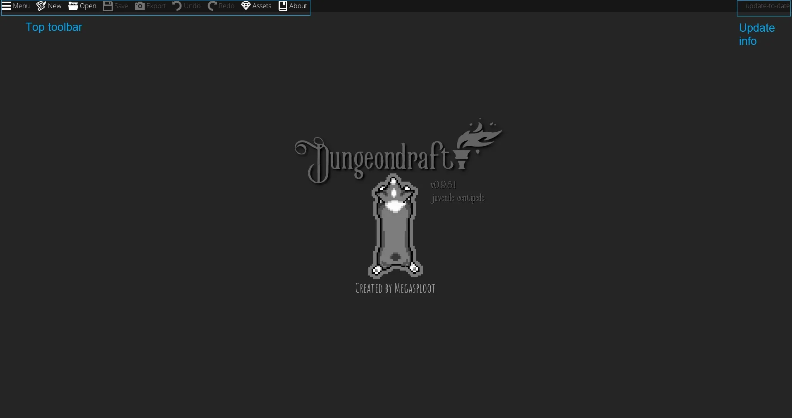
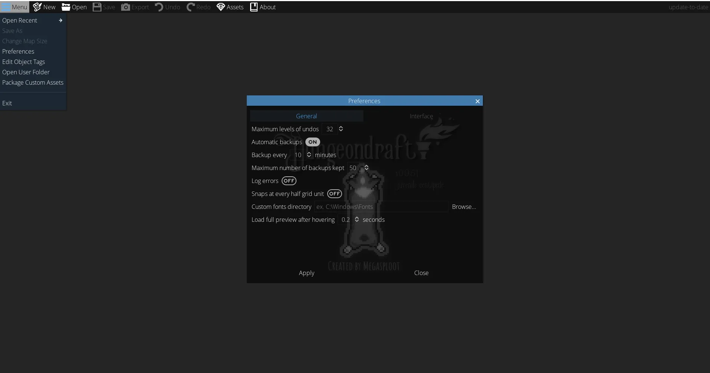
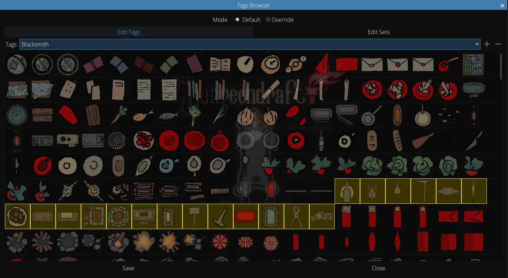
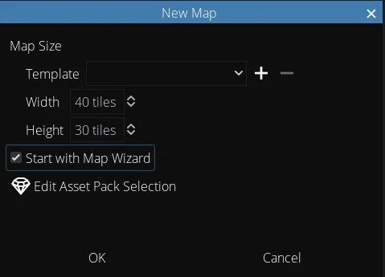
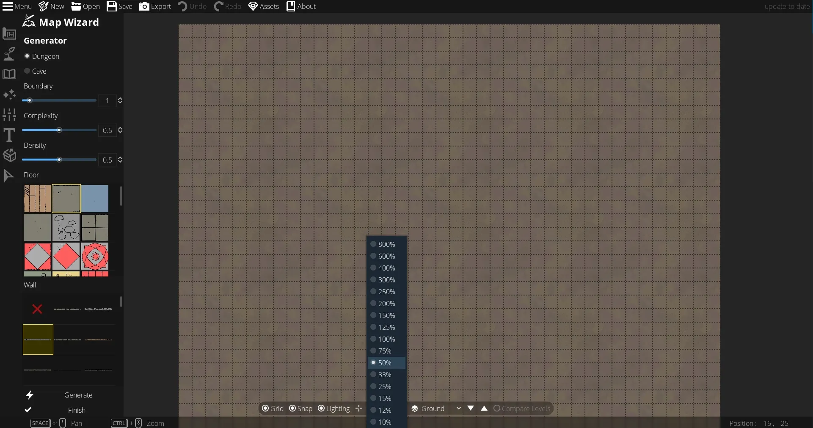
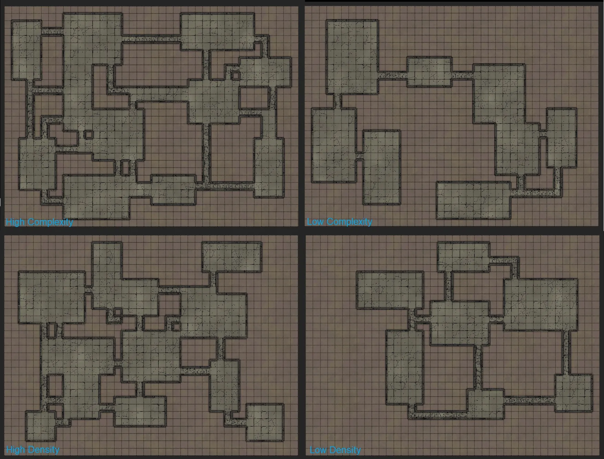

# Creating Maps & The Map Wizard
From twisting dungeons to spiraling towers, having a map that matches your idea for a scene makes any TTRPG more engaging and really helps communicate to your players exactly how in over their heads they may be.

## DungeonDraft Settings
When you first open up DungeonDraft, this is the title screen you’ll see. It has the version you’re currently on, the developer Megasploot’s logo, and all that good stuff. Up in the right hand corner, you can tell whether or not there’s a new update available – you can see mine says “Update to-date” so I’m all set, but if you need to update there will be a link which will take you to Humble Bundle where you can get the latest version.

<figure markdown>
  { loading=lazy }
  <figcaption>The DungeonDraft UI</figcaption>
</figure>

<figure class="right w400" markdown>
  { loading=lazy }
  <figcaption>You can customize your backup frequency, maximum level of ‘undo’s, and more from the ‘Preferences’ menu.</figcaption>
</figure>

Across the top are the basic menu options, some of which are for use when you’re actually creating a map, and so are currently grayed out.

In the ‘Menu’ section, you can open any maps you were recently working on from the ‘Open Recent’ dropdown.

‘Preferences’ lets you control some different settings, like how many times you can hit undo, automatic back ups, backup frequency, how many backups are kept, whether to log errors, if DungeonDraft should snap at each squares halfway point, your custom font directory, and when DungeonDraft should give you a full size preview of the object you’re hovering over. Personally, I like to get the full sized preview instantly so I drop this from .2 to 0 but you can change it to your preference.

<figure class="left w400" markdown>
  { loading=lazy }
  <figcaption>You can change the groups that objects are sorted into from the ‘Edit Object Tags’ menu.</figcaption>
</figure>

Next in the menu is the option to ‘Edit Object Tags’. This loads in the hundreds of DungeonDraft assets, and lets you customize the way they’re tagged or grouped into sets to make finding them easier.

After that is ‘Open User Folder,’ which takes you to your DungeonDraft user data and is a quick way to access your backups. Below that is ‘Package Custom Assets’ option which you can use to turn a properly configured folder of assets into a DungeonDraft asset pack. You can click into the step-by-step guide for instructions and check out an example template as well.

Lastly, we have an option to exit DungeonDraft.

We’ll get to the ‘New’ button up top here in a moment but first ‘Open’ lets you open any existing DungeonDraft maps you want to keep working on.

The next four buttons are grayed out since these are for use while you’re making a map, but to quickly summarize: ‘Save’ saves the map as a DungeonDraft file for future editing, ‘Export’ lets you save it as different file formats including a VTT file format that contains information on walls, doors, lights, and windows. Then we have the ‘Undo’ and ‘Redo’ buttons which are pretty self-explanatory.

The next available button is ‘Assets.’ One of the coolest parts of DungeonDraft is all the custom assets you can import to give your maps a completely different look, but there’s so much you can do here that it gets its [whole own video](https://www.youtube.com/watch?v=gXSYIY7WjCs){ target=_blank }. And, lastly, there’s the ‘About’ button to check out the licensing info and all that good stuff.

But, for now, let’s back up to that ‘New’ button and get started.

## Creating a New Map

<figure class="left w400" markdown>
  { loading=lazy }
  <figcaption>Uncheck the ‘Start with Map Wizard’ box to go right to a blank canvas.</figcaption>
</figure>

When you go to create a new map, this window pops up with some basic settings. The main point of interest is how big the map will be. You can set a template based on different TV sizes, paper sizes for printing, or enter your own width and height up to 128×128 tiles. If you’re playing D&D 5e where each tile represents 5 feet, that means you can make a 640 by 640 foot map, which is pretty massive. Let’s set this to a more manageable 40×30 for now.

I’m going to check ‘Start with Map Wizard’ so you can see what it does but you can feel free to skip it. You can also select which custom asset packs you want to use in this map. This can speed up load times and make finding objects easier since you won’t have to search through all your ship assets when you’re making a desert map for example.

Now, let’s hit ‘OK’ and you can see it generates this background for us to start on.

## Basic Controls

Before we dig into the map wizard, let’s quickly cover the controls for moving around the workspace.

<figure class="right w400" markdown>
  { loading=lazy }
  <figcaption>You can see the shortcuts for the current tools you’re on at the bottom of the screen.</figcaption>
</figure>

At the bottom, there are buttons to toggle on and off the grid, snapping, and lighting. You can also use the shortcut keys ‘G‘, ‘S‘, and ‘L‘ respectively. ‘Grid’ makes the grid visible or invisible. ‘Snap’ toggles whether objects and walls snap to the grid, and ‘Lighting’ enables or disables DungeonDraft’s dynamic lighting. The little crosshairs button (or the “H” key as a shortcut) pops up a crosshairs for finding specific coordinates.

!!! info "Find Shortcuts Easily"

    Keep an eye on the bottom of the DungeonDraft window as well as it will list the shortcuts available for whatever tool you have selected.

You can set a zoom level with the percentile drop-down or hold ++ctrl++ while scrolling to zoom in and out. The dropdown to the right of the zoom tool is the level of the map you’re working on and is set to ‘Ground’ by default. You’ll only need to mess with this if you’re making a multi-level map which we’ll look at later. You can flip between levels with the up and down arrows to the right, or compare levels with the far right radio button. Lastly, to pan around the map, hold space and move your mouse.

Now, let’s take a look at the Map Wizard.

## The Map Wizard

<figure class="left w450 video_container">
    <video controls="true" allowfullscreen="true">
        <source src="../../assets/dungeondraft-basics/creating-maps/generating-maps.mp4" type="video/mp4">
        Your browser does not support the video tag.
    </video>
    <figcaption markdown>Click ‘Generate’ to get a new, randomized dungeon layout.</figcaption>
</figure>

The Map Wizard is a great tool that lets you randomly generate dungeons and cave systems. There are a few options here to control the randomized results you get.

‘Boundary’ lets you pick how many spaces should be left blank around the edges of the map. So, if you need some outdoor space on the outside of a castle, this makes sure you’ll have it. ‘Complexity’ makes the layout more complex which means it will have more rooms and interconnecting hallways. ‘Density’ changes how tightly packed together the rooms and halls are. You can also select what floors and walls you want the dungeon to generate with.

When you click ‘Generate’ at the bottom, it will randomly create a dungeon layout for you. You can even keep clicking ‘Generate’ to create new random dungeons until you find one you like.

<figure class="right w400" markdown>
  { loading=lazy }
  <figcaption>DungeonDraft gives you lots of variability and control over the caves and dungeons that the Map Wizard can randomly generate.</figcaption>
</figure>

## Density/Complexity Comparison

Let’s quickly compare the complexity and density settings. With complexity turned down, you can see that the map it generated is more simple, with fewer connecting hallways and more simply-shaped rooms. With complexity raised up, lots of the rooms have multiple entrances and exits, and connect to each other in a more labyrinthine way.

If we drop density down, it creates a more spaced-out map, whereas having density up will make it very tight and compact.

## Caves

<figure class="right w450 clear video_container">
    <video controls="true" allowfullscreen="true">
        <source src="../../assets/dungeondraft-basics/creating-maps/caves.mp4" type="video/mp4">
        Your browser does not support the video tag.
    </video>
    <figcaption markdown>Like with dungeons, click ‘Generate’ to get a new, randomized cave layout.</figcaption>
</figure>

If you’re looking to generate a cave instead of a castle or dungeon, just switch over to ‘Cave’ at the top. Similar controls apply, minus the walls and floor selection, since, well, it’s a cave. Like with the dungeons, you can keep generating until you find a layout you like.

Keep in mind that for both the dungeons and caves if you find one that’s close but needs a little change, you can easily make those changes once you’re done with the map wizard. We’ll go over how to create new layouts and change existing ones in the next guide.

When you’re all set, hit ‘Finish,’ and it will bring you to the main map editor. If you don’t use the Map Wizard and want to skip right ahead to making your stuff by hand, this is where you would start. Now, we have a whole bunch of mapmaking tools to dig into here! In the next guide, we’ll be getting into the Design Tools.