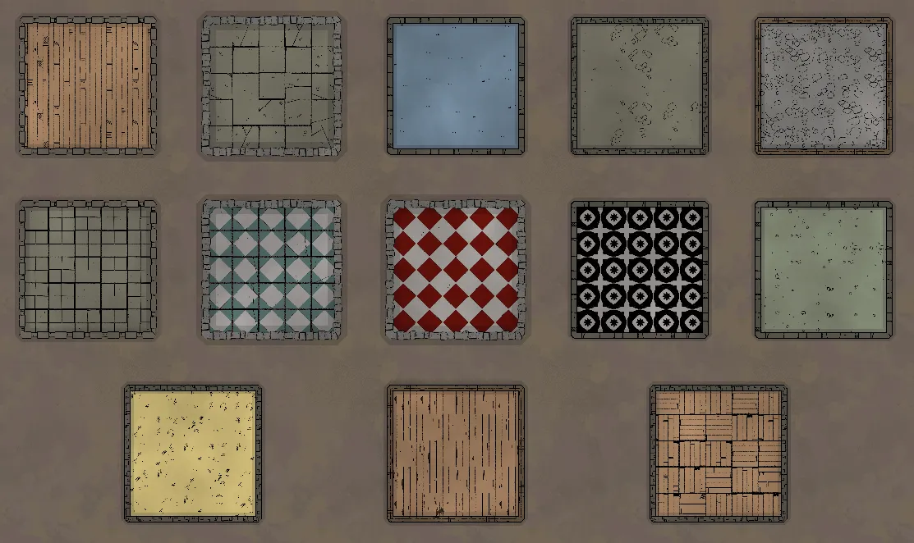
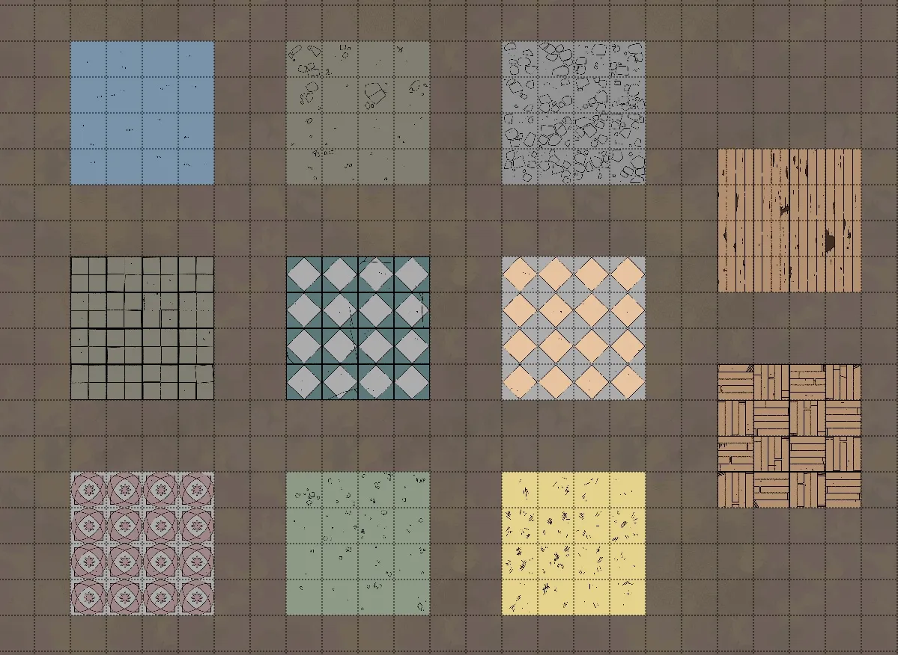
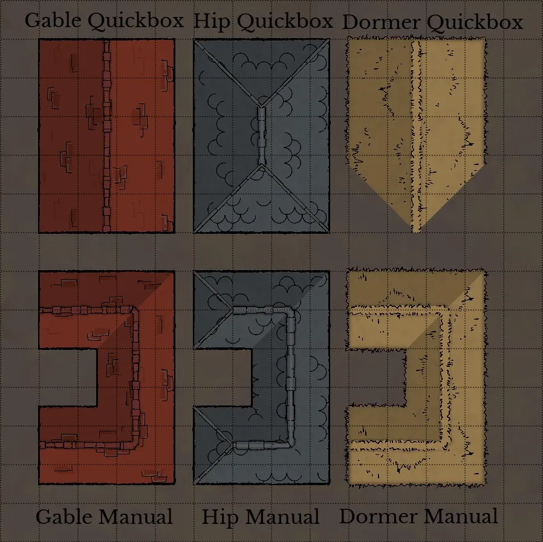

# The Design Tools
Now, we’re going to start fresh with a blank slate and get more into the DIY tools of DungeonDraft. We’ll be starting off with the Design Tools, which is the first category of tools in the left-hand sidebar.

<figure class="right w450 video_container">
    <video controls="true" allowfullscreen="true">
        <source src="../../assets/dungeondraft-basics/design-tools/building-tool-basics.webm" type="video/webm">
        Your browser does not support the video tag.
    </video>
    <figcaption markdown>Click and drag to create square and circular building, or click to place points for polygonal buildings.</figcaption>
</figure>

## Building Tool
The first tool in this section is the Building tool. This lets you place buildings complete with floors and walls using three basic shape options. The square button makes, as promised, square and rectangular buildings, the circle makes circular buildings, and the heart button lets you make polygonal shapes by clicking to place points wherever you want and then forming them into unique buildings when you close the shape.

### Expand and Combine Buildings

<figure class="left w450 video_container">
    <video controls="true" allowfullscreen="true">
        <source src="../../assets/dungeondraft-basics/design-tools/combine-buildings.webm" type="video/webm">
        Your browser does not support the video tag.
    </video>
    <figcaption markdown>Buildings can easily be connected together.</figcaption>
</figure>

Something neat about this tool is that you can expand an existing building by overlapping it with another. So, if you make a rectangle between two shapes (like in the WebM), it basically becomes a hallway. You can do this with any of the building options to get complex, interconnected structures.

!!! info "Curve Your Walls"

    In the heart-shaped tool, once you have a point placed, you can hold ++shift++ and click where you want the next one placed  and then drag to make a curved wall. The line indicating where the wall will be placed changes from yellow to purple and you can move your mouse until it’s precisely where you’d like it.

<figure class="right w450 video_container">
    <video controls="true" allowfullscreen="true">
        <source src="../../assets/dungeondraft-basics/design-tools/edit-points-in-wall.webm" type="video/webm">
        Your browser does not support the video tag.
    </video>
    <figcaption markdown>Click and drag a point to move it, or click on a line to create a new one.</figcaption>
</figure>

### Edit Walls

If you need to make a change, you can always click the ‘Edit Points’ button and hover over a wall to see its points. You can then click and drag the existing points to move them, or click in the middle of a wall to make a new one.

Lastly, holding ++alt++ while placing points puts you in an erase mode to quickly clear away any structures or parts of structures you don’t want.

### Various Designs Available

<figure class="left w400" markdown>
  { loading=lazy }
  <figcaption>Several of DungeonDraft’s floor patterns can have custom colors applied to them.</figcaption>
</figure>

As you can see we have a lot of options for floor and wall styles. There are 13 floor options and 5 wall options in the base software.

You can customize the color of all of the walls and several of the floors by clicking the color picker down below which gives you a lot more variety. You also have control over the alpha channel, which lets you control how opaque the floor is. This can make it look less saturated .

You can even switch colors and floor textures between rooms on the same map, and they’ll retain their respective floors even if you join them together with another building. However, a building does need to have the same wall type throughout it. So, if a building has wooden walls, but you join it with a stone-walled building, all the walls will convert to the one you currently have selected. That is, unless you’re using the wall tool. Let’s take a look at that now.

## Wall Tool

<figure class="right w450 video_container">
    <video controls="true" allowfullscreen="true">
        <source src="../../assets/dungeondraft-basics/design-tools/wall-placement-and-curve-demo.webm" type="video/webm">
        Your browser does not support the video tag.
    </video>
    <figcaption markdown>Hold shift to create a curved wall.</figcaption>
</figure>

The next tool down is the Wall tool. This tool lets us add in walls, which can be freestanding or placed inside to create additional rooms. You’ll see lots of the same options here – ‘Edit Points,’ the same wall textures we have in the buildings tool, and the color selector. The same controls also apply, like holding ++shift++ to add a curved wall.

What’s new though is the “over/under” button. This won’t let you go over walls placed by the building tool, but it does let you choose how to layer inner walls. There’s also a button to toggle shadows on walls on or off.

## Portal Tool

<figure class="left clear w450 video_container">
    <video controls="true" allowfullscreen="true">
        <source src="../../assets/dungeondraft-basics/design-tools/portal-with-different-light-and-anchor-options.webm" type="video/webm">
        Your browser does not support the video tag.
    </video>
    <figcaption markdown>With the ‘Anchored’ setting on, portals can only be placed on walls. Change this to ‘Freestanding’ to place a portal anywhere.</figcaption>
</figure>

Next up is the Portal Tool, which is for adding doors and windows. The first option at the top here lets us block or allow light, depending on if you want to let light from DungeonDraft’s dynamic lighting tool pass through.

The ‘Anchored’ setting means that the door needs to be placed on a wall. When it’s active there’s a ‘Rotate 180’ button to flip its direction.

If you switch it to ‘Freestanding’ though, the ‘Rotate 180’ button changes to a rotation slider that you can also control with your scroll wheel, and this will let you place doors anywhere on the map (and at any angle), in case you want a freestanding door or for the door to look open.

## Cave Brush Tool

<figure class="right w450 video_container">
    <video controls="true" allowfullscreen="true">
        <source src="../../assets/dungeondraft-basics/design-tools/cavedig.webm" type="video/webm">
        Your browser does not support the video tag.
    </video>
    <figcaption markdown>‘Dig Cave’ allows you to brush in cave structures, while ‘Blast Open’ creates openings in those caves.</figcaption>
</figure>

After that we have the ‘Cave Brush’ tool. You can scroll to go between brush sizes or click the one you want.

You can also change the color of the floor and walls of the cave. And, like we saw before, you can adjust the opacity of them with the alpha channel at the bottom of each color picker window. You can see terrain through the bottom of translucent cave floors, so you can get some interesting effects.

Then, we have the ‘Brush Mode’ which can be set to ‘Dig Cave’ or ‘Blast Open’. ‘Dig Cave’ will let you brush in cave structures and ‘Blast Open’ will let you create an opening in the cave where ever you brush.

Like the building tool, hold ++alt++ to erase instead. This is an easy way to make changes to a cave layout that the Map Wizard generated.

Toggling the last button to ‘Show Blast Opened Area’ will make the opening clearly visible with hatch marks.

## Pattern Shape Tool

<figure class="left w400" markdown>
  { loading=lazy }
  <figcaption>Several of the patterns in the ‘Pattern Shape’ tool are colorable.</figcaption>
</figure>

Next is the Pattern Shape tool. This is sort of like placing floors without placing walls. This tool works the same as the others have when set to square, circle, or polygonal placement as well as being able to edit points and rotate the placed pattern. You can also change the color of the patterns the same way you could with the floors earlier.

There is one other option here that you’ll see in a lot of other places though, which is to select a layer to place the pattern on. By default, it will use ‘User Layer 1’ but there are 8 different layers that you can place patterns and objects on depending on what you want it above and what you want it under.

## Roof Tool

<figure class="right w400" markdown>
  { loading=lazy }
  <figcaption>There are three roof textures and three roof shapes to utilize.</figcaption>
</figure>

The last tool in this section is the Roof tool. This is an awesome tool for quickly shelling out city streets and villages.

You have two different ways to create these roofs: Either a quickbox, which lets you quickly drag out a rectangular shape, or manually, where you can click to place points individually. There are three different roof styles and three different roof textures to choose as well. Setting some to go above others with the over/under options can give you some great layered looks, especially since these roofs automatically apply a shadow effect along the gables. You can toggle the shade effect on or off. With it on, you can also control the direction of the shade on the roofs, a well as how dark the shade should be.

That covers the design tools! These are what you’ll use to create the buildings and caves that are the core of your map. Next up, we’ll take a look at the Terrain Tools in DungeonDraft to make the outside look as great as the inside.