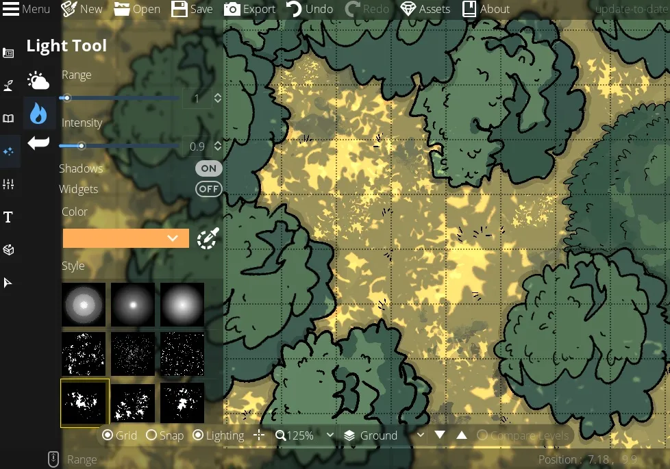

# The Light and Text Tools
In this guide, we’ll go over DungeonDraft’s Lighting and Text tools. The dynamic lighting system can add so much depth and interest to your maps, and the Text tool is simple but handy! Let’s take a look at the section of Lighting tools first.

<figure class="right w450 video_container">
    <video controls="true" allowfullscreen="true">
        <source src="../../assets/dungeondraft-basics/lighting-text-tools/environmental-lighting.webm" type="video/webm">
        Your browser does not support the video tag.
    </video>
    <figcaption markdown>‘Environmental Lighting’ applies a lighting effect to the entire map.</figcaption>
</figure>

## Environmental Lighting
The first tool in this section is the Environmental Lighting. This is ambient light that covers the entire map, regardless of any walls that might be in the way. This tool is pretty straightforward, using the color picker you can control the color and opacity of the color. You can make it seem darker and more ominous, or just give it a warmer or cooler tint to match the mood of the scene.

<figure class="right w450 video_container">
    <video controls="true" allowfullscreen="true">
        <source src="../../assets/dungeondraft-basics/lighting-text-tools/placing-lights.webm" type="video/webm">
        Your browser does not support the video tag.
    </video>
    <figcaption markdown>Use the ‘Light Tool’ to place localized lighting effects.</figcaption>
</figure>

## The Light Tool
The next tool down is the Light tool. This allows you to place individual light sources on your maps. You can control the range of how big the light should be, the intensity, and the color. So, for these candles, you may want to drop the range and intensity down and make it a softer yellow, but for the campfire outside, you may want to turn both up higher and have it be a brighter orange color.

### Walls and Shadows

<figure class="right w450 video_container">
    <video controls="true" allowfullscreen="true">
        <source src="../../assets/dungeondraft-basics/lighting-text-tools/allow-lights.webm" type="video/webm">
        Your browser does not support the video tag.
    </video>
    <figcaption markdown>Use the ‘Light Tool’ to place localized lighting effects.</figcaption>
</figure>

Now, by default, you can see that these lights interact with the walls we’ve put down. The light is blocked by the walls, but actually passes through the windows if you set the portal to ‘allow light’. A quick tip here is that if you’ve set your doors or windows to block light, you can actually apply the lighting effect to them directly at different angles, still giving you that effect of having the light come in from the outside, even if you don’t want to directly place a light source outside. You should also notice that objects in the room don’t cast additional shadows from the light.

If you want to place lights that aren’t blocked by buildings, cave walls, and so on, you can turn “shadows” off in the sidebar under the ‘Intensity’ slider. The ‘Widgets’ option will put a dotted line around the lights, just making it a little easier to see exactly where they are.

<figure class="right w400" markdown>
  { loading=lazy }
  <figcaption>Use the different light styles to create detailed, textures effects like a forest floor.</figcaption>
</figure>

### Light Shapes

One of the best features of this light tool, though, is the different shape options you can choose from the ‘Style’ selection. These different radial circles are great to give a candle a different appearance from a streetlamp or a fire, for example.

There are more light styles that you can get from custom assets like the light being filtered through tree leaves onto a forest floor in this image that come from the Forgotten Adventures asset packs.

<figure class="right clear w450 video_container">
    <video controls="true" allowfullscreen="true">
        <source src="../../assets/dungeondraft-basics/lighting-text-tools/text-tool.webm" type="video/webm">
        Your browser does not support the video tag.
    </video>
    <figcaption markdown>Use the ‘Text Tool’ to label maps for GM use.</figcaption>
</figure>

## Text Tool
We’re going to skip the settings in the sidebar for now and quickly hit the Text Tool which is pretty straightforward. You can type, edit text, move text, change its font, size, and color, and toggle whether or not it’s in a text box. You can also turn the general visibility of text on and off. This could be a good way to add labels to the map for GM use, like numbering rooms in a dungeon, then export it with the numbers for you and without them for your players. 

That covers the light and text tools! Next up, we’ll take a look at how to make multi-leveled maps in DungeonDraft.