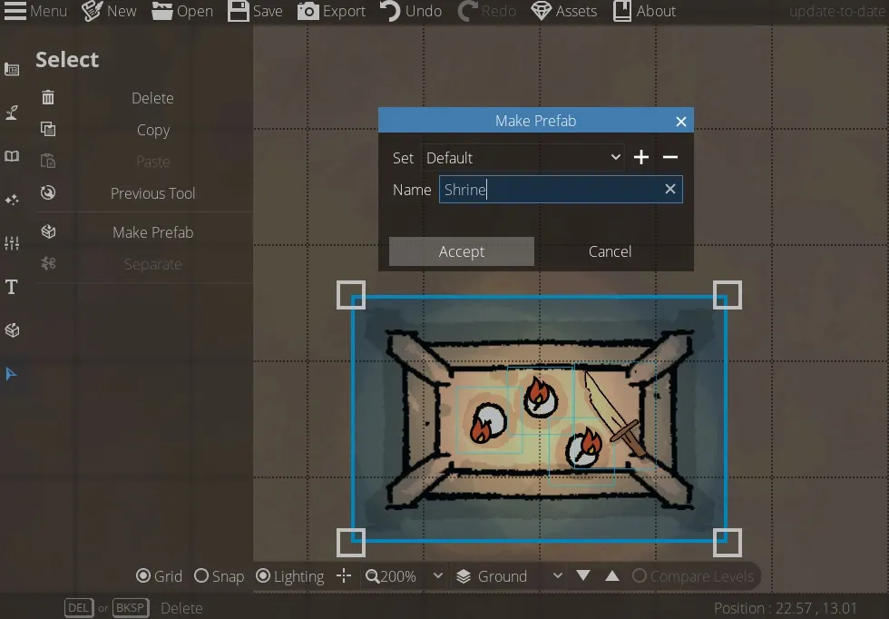

# Making Prefabs and Using the Select Tool
A great feature that can save you a ton of time once you find looks that you like is making prefabs. These are made in the Select tool, so we’ll cover that to begin with.

<figure class="right w450 video_container">
    <video controls="true" allowfullscreen="true">
        <source src="../../assets/dungeondraft-basics/making-prefabs-select-tool/select.webm" type="video/webm">
        Your browser does not support the video tag.
    </video>
    <figcaption markdown>You can change an object’s size, position, rotation and color using the ‘Select Tool’.</figcaption>
</figure>

## The Select Tool
The ‘Select Tool’ is the bottom tool in the left-hand sidebar. It lets you individually click on things on your map like objects, light sources, and buildings, or drag to select multiple at once. You can copy and paste them, change their over/under setting, switch them to a different layer altogether, change their color if it’s colorable, or just delete them. You can click and drag objects and light sources to move them, drag their corners to resize them, or click and drag just outside their highlighted box to rotate them. For most things in DungeonDraft, clicking on it with the select tool lets you change a lot of the original things you selected when you placed it.

<figure class="right clear w450" markdown>
  { loading=lazy }
  <figcaption>Select all the objects you want to include, then hit ‘Make Prefab.’</figcaption>
</figure>

## Making Prefabs
Now, you’ll notice these two buttons in the middle here – ‘Make Prefab’ and ‘Separate.’ A prefab is basically a group of objects and/or light sources that you can place all at once rather than individually. So, say you’ve stacked a bunch of barrels really nicely and use that in your taverns a lot, you’ve carefully situated a light source on each candle on a shrine, or you’ve combined a bunch of assets together cleverly to make something new, and you want easy access to it in the future. Click and drag to highlight all the objects and light sources you want to include, then hit the ‘Make Prefab’ button. A window will pop up with a few options. It will add your prefab to the ‘Default’ set to begin with, but if you want you can hit the ‘+’ to create your own sets to keep them organized and the ‘-‘ key to delete a set. Then, you can enter a name and hit accept.

### Sets

<figure class="right w450 video_container">
    <video controls="true" allowfullscreen="true">
        <source src="../../assets/dungeondraft-basics/making-prefabs-select-tool/prefabs.webm" type="video/webm">
        Your browser does not support the video tag.
    </video>
    <figcaption markdown>Click ‘Place’ to insert a prefab onto the map.</figcaption>
</figure>

If you click over to the ‘Prefabs’ tab (just above the ‘Select’ tool), you can choose whichever set – ‘Default’ or otherwise – you put your prefab in, click on the one you want, then hit ‘Place.’ The objects will be dropped onto the middle of your map, all grouped together and ready to go! As a side note, if you click this multiple times, you’ll still only see it in the one place, but if we switch back to the select tool and drag it away, you’ll see that multiple copies did appear. You can rotate and resize your prefab all as one convenient item. Or, if you want to split them apart, click on the group, and from the select tool, hit ‘Separate’ to break it up into its component objects. You can also hit ‘Forget’ from the prefabs menu to delete them.

When you create a prefab it will be saved here and will be there ready to go for you the next time you load up DungeonDraft too.

Prefabs can be a huge timesaver, especially once you’ve found some looks you really like incorporating into your maps or you’ve made something unique. In the final part of this guide, we’ll cover the remaining map settings and how to export maps.