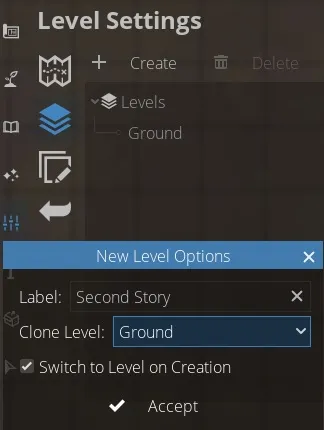

# Making Multi-Level Maps
So far, everything we’ve done on a map has been on the ground level only. But, what if you wanted to add a second story to a building or create a multi-leveled dungeon? In DungeonDraft, you can create maps with multiple levels to do exactly that.

## Adding a New Level

<figure class="right w400" markdown>
  { loading=lazy }
  <figcaption>You can clone an existing level when creating a new one.</figcaption>
</figure>

We’re starting with a ground floor where we have a simple one room home. To add another level to the map go to the ‘Settings’ tab of the left-hand sidebar and click into ‘Level Settings’. As you can see, the only level currently is the ‘Ground’ level. Hit the “+ Create” button to add in a new level, and this little box of options will pop up. We’ll name it ‘Second Story.’ You can see it also gives you the option to clone a level. This is great if you’re using it for a case like this, where you’re making a second story, since it makes an exact replica of the level below. That way, you have identical building shape and placement, and can just fill in the floors as needed. You can also have it not clone a level, and you’ll just start with a blank slate. We’ll also leave ‘Switch to Level on Creation’ checked so it pulls us over right away. It’s important to also note that each ‘level’ gets its own unique set of ‘layers’.

With the new level created, you’ll see now that the dropdown in the bottom toolbar has switched from ‘Ground’ to ‘Second Story’. Whenever you want, you can use that dropdown, or the arrows beside it, to switch between your levels.

## Comparing Levels

<figure class="right w450 video_container">
    <video controls="true" allowfullscreen="true">
        <source src="../../assets/dungeondraft-basics/multi-level-maps/compare-levels.webm" type="video/webm">
        Your browser does not support the video tag.
    </video>
    <figcaption markdown>Use the ‘Compare Levels’ option to view two levels simultaneously.</figcaption>
</figure>

A super useful feature here is this ‘Compare Levels’ button. If you check that, this menu pops up. Set your reference level – for example, we’re working on the ‘Second Story,’ but I want to reference the ‘Ground’ level to make sure two rooms line up nicely. Then, you can adjust the opacity of each level until you get them where you want them, hit OK, and you get a stacked view of both layers at once. This lets you add to your current level while being able to use another level as a reference. Uncheck this option whenever you’re finished to get back to the normal, not-see-through view of the map.

## Exporting Multi-Level Maps

<figure class="right clear w450 video_container">
    <video controls="true" allowfullscreen="true">
        <source src="../../assets/dungeondraft-basics/multi-level-maps/overlays.webm" type="video/webm">
        Your browser does not support the video tag.
    </video>
    <figcaption markdown>Set a ‘Source Level’ and ‘Overlay Level’ with varying focus and opacity to change how your levels interact.</figcaption>
</figure>

There are some unique settings you can apply when exporting a multi-level map. We’ll go over the full export options in the last guide in this series, but for now, we’re just focusing on how to get the most out of multiple levels when exporting. When your map is all ready to go, click the ‘Export’ button up in the top toolbar.

In this menu, you can select a source level to export if you want to save the levels separately. But, these next settings are where you can get into some really neat use cases with levels. You can alter the brightness and focus of your source level to make it darker or blurrier. Then, you can choose an overlay level to go above it, and can control the opacity of that overlay level. This is great for things like having your source level be the deck of a ship, but overlaying transparent sails so you can still see the deck below. Or, maybe your map is of an upper walkway in a city somewhere – you can overlay the walkway over a blurred-out city street sprawling beneath it. Even for something as simple as exporting the second story of a building, you can lay it over the ground level and blur out the ground level to get a really great height effect.

There is so much you can do with adding additional levels to your maps but this should give you a solid base to experiment from. In the next guide, we’ll be going over making ‘Prefabs’ and using the Select tool.