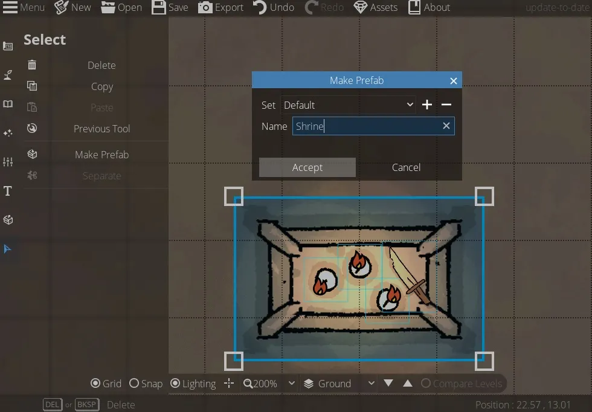

# Map Settings, Image Tracing, and Exporting Maps
By now, you’re basically a pro at making maps in DungeonDraft! We’re going to quickly go over the remaining settings you can change to customize your maps. We’ll also cover how to export maps with the right settings for how you’ll be using them.

<figure class="right w450 video_container">
    <video controls="true" allowfullscreen="true">
        <source src="../../assets/dungeondraft-basics/settings-tracing-exporting/camera-filters.webm" type="video/webm">
        Your browser does not support the video tag.
    </video>
    <figcaption markdown>You can apply Printer-Friendly and Sepia filters to your maps.</figcaption>
</figure>

## Map Settings

Let’s change over to the ‘Settings’ section of the left-hand sidebar and take a look at the first tool: Map Settings. Within this menu, you can change your grid color to something that contrasts with your map more, or drop the opacity of it down if you prefer it to be more subtle. Remember you can also always turn the grid off by checking that button at the bottom, or pressing ‘G.’ You can also set filters over your maps here. ‘Printer Friendly’ puts it all in black and white so you don’t use a ton of ink and ‘Sepia’ could make for some neat in-game handouts.

The next section of settings is Level Settings, but there’s so much to do with levels that it got its whole own guide, so we’re skipping that here.

## Tracing an Image

<figure class="right w450 video_container">
    <video controls="true" allowfullscreen="true">
        <source src="../../assets/dungeondraft-basics/making-prefabs-select-tool/select.webm" type="video/webm">
        Your browser does not support the video tag.
    </video>
    <figcaption markdown>You can import an image to trace or use as a reference while creating a map.</figcaption>
</figure>

The last option in this section is ‘Trace Image,’ which is another really useful feature. If you’re trying to replicate a certain layout, like recreating a map from an existing adventure to use in a VTT, you can upload that image here. It will appear as if behind the map, and you can change its scale and opacity. Click the “center” button to center it on the map, or drag it around until it’s where you want it.

You can only move the tracing image when you’re on this tab of settings, so if you switch over to start laying out buildings and decide it needs to move just come back here. Then when you’re done tracing or want a different image you can click the rounded arrow button to clear the image away and marvel at the beautiful map you definitely didn’t just plagiarize.

## Exporting Maps

<figure class="right clear w450" markdown>
  { loading=lazy }
  <figcaption>Click the ‘Export’ button in the top toolbar to save your map as a PNG, JPG or VTT file.</figcaption>
</figure>

Now that you know the basics of making awesome maps in DungeonDraft, let’s see how to actually get them out of the canvas and into your printer or VTT of choice. Clicking the “Export” button up in the top bar gives us the following options: You can export as a PNG, a JPG (with a quality slider), or a Universal VTT file. If you’re using Foundry or another VTT, you can import these directly (or with a module) and your walls and lights will already be in place, which is pretty rad.

You can toggle your grid and lighting on and off from here. You can also select a source level and overlay level if your map has multiple levels, and these settings are discussed in-depth over in the Levels guide. 

Next up are ‘Camera Filter’ settings, which we discussed before. You can switch to a printer-friendly version or a sepia tone version of your map here. Below that is a ‘Grid Preset’ setting, so you can export to specifically fit different sizes, such as 40″ and 55″ TVs. Changing the grid preset will change the Grid PPI below, but you can also manually set a grid PPI if needed, like if you’re intending to print out your map. Most printers will do best with 300 PPI but check your printer settings to be sure.

Once your map is ready to go and your settings are lined up, just hit export, and you’re all set! DungeonDraft is a great tool for making custom maps, whether you’re printing them or using them on a VTT. I hope this guide has been a useful crash course on all the good stuff you can do in DungeonDraft!