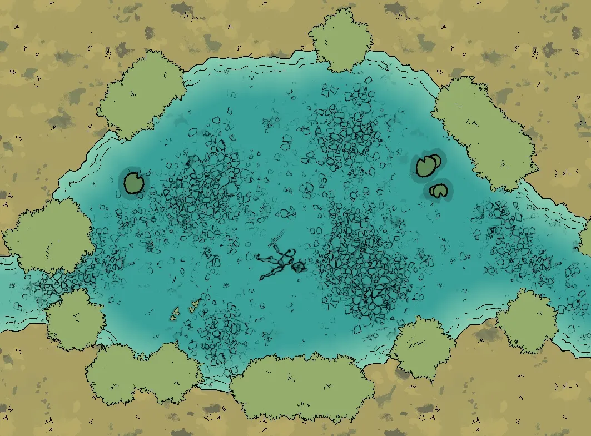
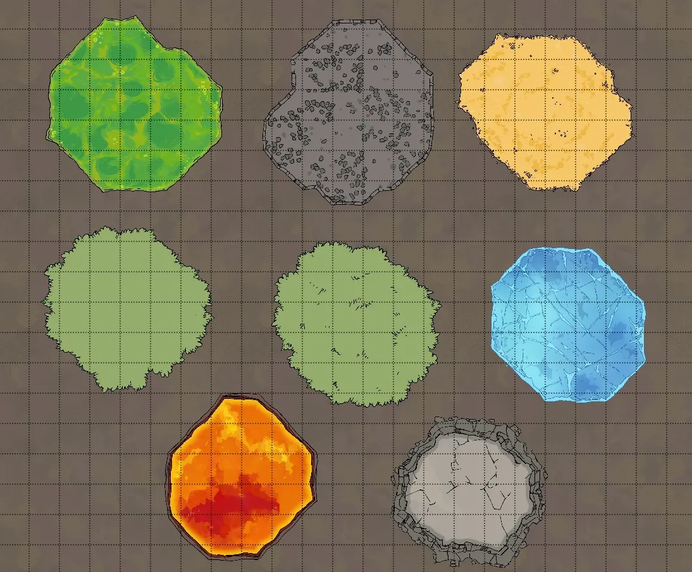

# The Terrain Tools
The next category of tools we’ll be looking at are the Terrain tools which are the second from the top in the left-hand sidebar.

## Terrain Brush

<figure class="right w450 video_container">
    <video controls="true" allowfullscreen="true">
        <source src="../../assets/dungeondraft-basics/terrain-tools/terrain-brush.webm" type="video/webm">
        Your browser does not support the video tag.
    </video>
    <figcaption markdown>Changing the ‘Intensity’ changes how quickly the terrain will fill in.</figcaption>
</figure>

The first tool in this category is the Terrain Brush. Firstly, from here, you can toggle terrain on or off. If you turn it off, you just have the grid and a transparent background, which can be useful for making layered maps, but you’ll usually leave terrain turned on. You can change the size of your brush and the intensity of it, which is basically how quickly the terrain pattern fills in. To use a terrain, just paint it onto your canvas.

By default, you can use 4 terrain slots at once. There is an option to enable 4 more, but it consumes a lot more of your computer’s video memory which can impact your performance if you don’t have a dedicated graphics card. But, I’m not your mom. Go crazy.

<figure class="right w450 video_container">
    <video controls="true" allowfullscreen="true">
        <source src="../../assets/dungeondraft-basics/terrain-tools/terrain-biome-options.webm" type="video/webm">
        Your browser does not support the video tag.
    </video>
    <figcaption markdown>Click the white grid squares to replace a terrain.</figcaption>
</figure>

### Changing Terrains

You can sort terrains by biomes, such as barren, swamp, desert, mountain, prairie, rainforest, and settlements, which will fill these slots in with 4 relevant terrains. You can also switch them out individually by clicking the white squares to each one’s right side, which opens the full list of terrains, including some that aren’t in any of the biomes, like the Void terrain. You can then hit fill at the bottom to fill the whole canvas with your selected terrain, or brush them on individually to get some nice mixed effects.

Once you’ve added a terrain to the canvas, if you switch that slot out for a different terrain, it will also update anywhere on the canvas that you used that specific terrain. So, if I put some dirt on the canvas, then switch dirt out for snow, it would change all my existing dirt terrain into snow. This is a quick and easy way to try out lots of different looks.

<figure class="right w450 video_container">
    <video controls="true" allowfullscreen="true">
        <source src="../../assets/dungeondraft-basics/terrain-tools/terrain-and-buildings.webm" type="video/webm">
        Your browser does not support the video tag.
    </video>
    <figcaption markdown>Terrains apply to the lowest layer of the map.</figcaption>
</figure>

### The Terrain Layer
Terrain is the lowest layer of our map, which means that if we have a building on the map and paint some terrain on it, it will appear around the sides, but it will not go over the floor of the building. It works the same way for caves when the cave floor is opaque. You can also get some interesting effects by layering terrain under transparent cave floors and the like.

## Water Brush

<figure class="right w450 video_container">
    <video controls="true" allowfullscreen="true">
        <source src="../../assets/dungeondraft-basics/terrain-tools/water-brush.webm" type="video/webm">
        Your browser does not support the video tag.
    </video>
    <figcaption markdown>You can change the colors of shallow and deep water, as well as how quickly those colors transition.</figcaption>
</figure>
The next tool is the water brush. I’m sure these controls look familiar by now – we’ve got different brush sizes that you can use the scroll wheel to swap between, or the more precise shape drawing tools. These each make water that has a nice shaded look to it with a subtle water animation. Like buildings, if you connect separate bodies of water together, they will join into one and blend together nicely.

You can also adjust the color of the water at its deep and shallow points, making it murky swamp water or a light, clear water as needed. Different pools of water on the same map can be created with different colors, but if you join them together, like walls, they will take on the color of your current selection. Changing the blend distance will change how quickly it transitions from the deep into the shallow color.

<figure class="right w400" markdown>
  { loading=lazy }
  <figcaption>You can place objects and materials above or below water.</figcaption>
</figure>

### The Water Layer
Water is another thing that you can layer over different terrains since it’s transparent. You can get some really neat effects, like layering water over the gravel terrain for a rocky shore. Water gets its own layer in DungeonDraft, so you can easily place textures and objects over or under it as needed.

<figure class="right w400" markdown>
  { loading=lazy }
  <figcaption>Materials can be brushed onto different layers to create layered height effects.</figcaption>
</figure>

## Material Brush
Next up is the material brush. This lets you brush in some additional materials like acid, cobblestones, gold, different grasses, ice, lava, and rock. You’ll notice you can also change the layer that you’re painting onto, and whether or not it should be moved to the front of that current layer. Like water and buildings, patches of the same material on the same layer that you brush on will join together. Painting with the material brush on different layers is a great way to simulate elevation.

<figure class="right w450 video_container">
    <video controls="true" allowfullscreen="true">
        <source src="../../assets/dungeondraft-basics/terrain-tools/material-layers.webm" type="video/webm">
        Your browser does not support the video tag.
    </video>
    <figcaption markdown>You can change which layer you apply materials to.</figcaption>
</figure>

### The Material Layer
By default, materials head to the ‘Below Ground’ layer. But, maybe you want a nice grass-lined pond. If you change to ‘User Layer 1’ so it’s above your water, you can brush grass around the pond to make a nice little meadow. The grass material will overlap the water neatly with a nice finished edge around it.

<figure class="right w450 video_container">
    <video controls="true" allowfullscreen="true">
        <source src="../../assets/dungeondraft-basics/terrain-tools/layered-material.webm" type="video/webm">
        Your browser does not support the video tag.
    </video>
    <figcaption markdown>You can change which layer you apply materials to.</figcaption>
</figure>

### Adding Texture and Depth
There are some great uses for the material brush to bring depth and texture to your maps. For example, the rock tile makes great layered caves or cliff faces. You can add some in, switch to a higher layer, and then stack more on top to create an uneven surface. You can even combine different materials together, like adding some grass onto those cliffs, to get some great effects.

<figure class="right w450 video_container">
    <video controls="true" allowfullscreen="true">
        <source src="../../assets/dungeondraft-basics/terrain-tools/path-tool.webm" type="video/webm">
        Your browser does not support the video tag.
    </video>
    <figcaption markdown>Click to place points on a path, then double click to end.</figcaption>
</figure>

## Path Tool
The last tool in this section is the path tool. You’ll see some controls that we’re already familiar with, like ‘Edit Points’, a layer selector, and the ‘Over/Under’ sorting options. ‘Width’ is pretty straightforward – it makes the path you’re placing wider or smaller. The ‘Transition In and Out’ settings can make your paths appear and disappear more seamlessly by making them either have a transparency effect or a gradual grow/shrink effect at the ends.

The base software includes 16 paths that can be expanded with custom assets.

<figure class="right w450 video_container">
    <video controls="true" allowfullscreen="true">
        <source src="../../assets/dungeondraft-basics/terrain-tools/path-smoothness.webm" type="video/webm">
        Your browser does not support the video tag.
    </video>
    <figcaption markdown>Setting ‘Smoothness’ to 1 will make rounded paths, whereas setting it to 0 will make angular paths.</figcaption>
</figure>

### Smoothing Out Paths
Smoothness can change how your path looks significantly, so let’s take a closer look at that. To start a path, click to place a point. Then you can click around to place other points wherever you’d like. I’m going to loop this one back to where we started, and you can see it makes a nice, smooth circle, automatically joining it all together.

If we change smoothness down to 0 and do that again, though, the path will turn sharply instead of arcing. So, you’ve got lots of degrees of control.

<figure class="right w450 video_container">
    <video controls="true" allowfullscreen="true">
        <source src="../../assets/dungeondraft-basics/terrain-tools/path-layers.webm" type="video/webm">
        Your browser does not support the video tag.
    </video>
    <figcaption markdown>You can change which layer your paths will go on.</figcaption>
</figure>

### Path Layers
Of course, since you can change the layer of the paths, this is another place to get some interesting layer effects. For example, leaving this on ‘User Layer 1’ lets us create a bridge over the water, but if we change the layer to ‘Below water,’ then we could run this railroad track right underneath the water, where it gets this cool distorted look from the water above it.

In the next guide, we’ll go over how to fill out your maps using objects. Remember, there are also tons of custom assets you can add that give you even more options for walls, floors, terrains and paths to customize your maps, so be sure to check out the guide on using custom asset packs too!