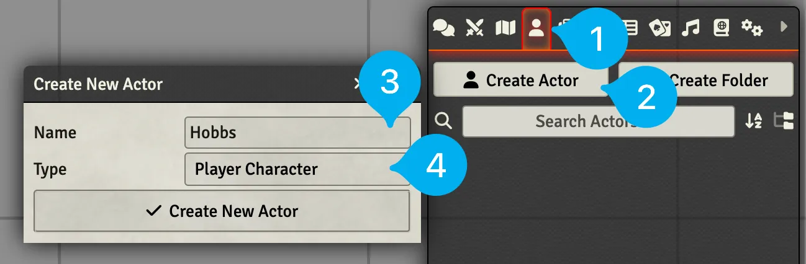

# Actors
Actors are what you'll use to represent your player's Characters, creatures in the world, and NPCs as well as things like Vehicles and Groups. You can think of an Actor as the character sheet or statblock of a creature.

---

## Create an Actor

??? foundry-tip "Actor Types"

    Most Game Systems have more than one type of Actor. For example, DnD5E has `Player Character`, `Non-Player Character`, `Vehicle`, and `Group`.

<figure class="right w350" markdown>
  { loading=lazy }
  <figcaption>Create an Actor</figcaption>
</figure>

1. Change to the :fontawesome-solid-user: Actors tab in the sidebar.
2. Press the :fontawesome-solid-user: Create Actor button.
3. Enter a name for your Actor.
4. Select the type of Actor you would like and press :fontawesome-solid-check: Create New Actor