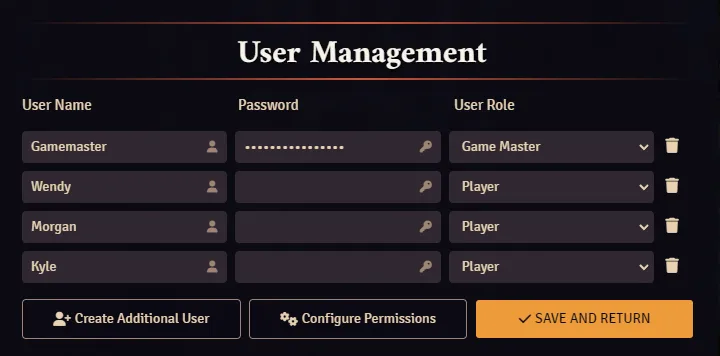
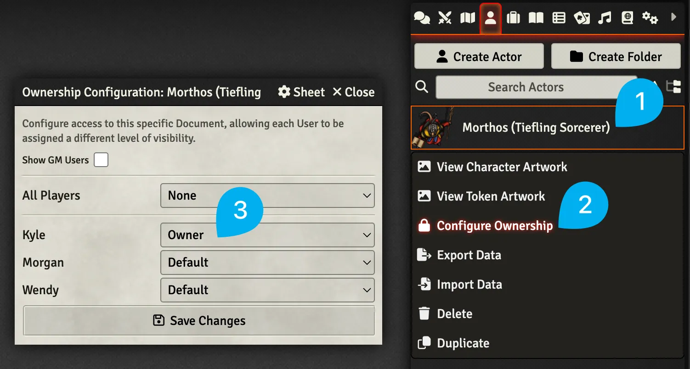
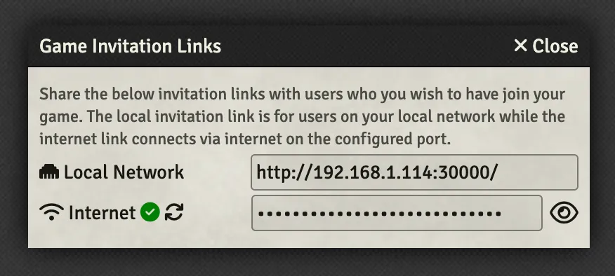

# Add Players

Players need an account set up in your World to log in. You'll also use this account to give them ownership of their Actor and other things like Journal Entries and Items.

---

## Create Player Accounts

<figure class="right w450" markdown>
  { loading=lazy }
  <figcaption>The User Management Page</figcaption>
</figure>

1. Change to the :material-cogs: Settings tab of the right-hand sidebar.
2. Click on the :fontawesome-solid-users: User Management button.
3. Press the :fontawesome-solid-user-plus: Create Additional User button.
4. Enter a username.
5. Set an optional password.
6. Select their User Role.
7. Press the :fontawesome-solid-check: Save and Return button.

---

## Give a Player Ownership of an Actor

<figure class="right w450" markdown>
  { loading=lazy }
  <figcaption>Steps to Configure Actor Ownership</figcaption>
</figure>

1. Find an Actor you want to give one of your Player's ownership of and right click on it.
2. Select :fontawesome-solid-lock: Configure Ownership.
3. Update the dropdown with the correct ownership option:
    - **Default:** The configured default
    - **None:** Can not see in the sidebar or open their character sheet
    - **Limited:** Can see in the sidebar, open its character sheet, but has a limited view of it.
    - **Observer:** Can see in the sidebar, open its character sheet, but can not change it.
    - **Owner:** Can see in the sidebar, open its character sheet, and make changes.

---

## Invite Players to Your World

<figure class="right w450" markdown>
  { loading=lazy }
  <figcaption>Sending Invitation Links</figcaption>
</figure>

1. Change to the :fontawesome-solid-gears: Settings tab of the right-hand sidebar.
2. Click on the :fontawesome-solid-wifi: Invitation Links button.
3. Click on the :fontawesome-solid-ethernet: Local Network or :fontawesome-solid-wifi: Internet invitation link to copy it and send it to your players.
    - Choose the :fontawesome-solid-ethernet: Local Network link if your players are on the same wireless network as you, for example, if they're all at your house for an in-person game.
    - Choose the :fontawesome-solid-wifi: Internet link if your players are not on the same wireless network than you and you're playing remotely.

!!! foundry-tip "What to do if you see a red X next to your Internet link:"

    If there's a red X next to your Internet link that means your network is not currently open and your players <u>**will not**</u> be able to connect to your game. You may need to [port forward](https://foundryvtt.com/article/port-forwarding/){:target="_blank"} or make other changes for this to work. You can get assistance on this setup in the Foundry VTT [Discord](https://discord.gg/FoundryVTT){:target="_blank"}'s #install-and-connection channel.