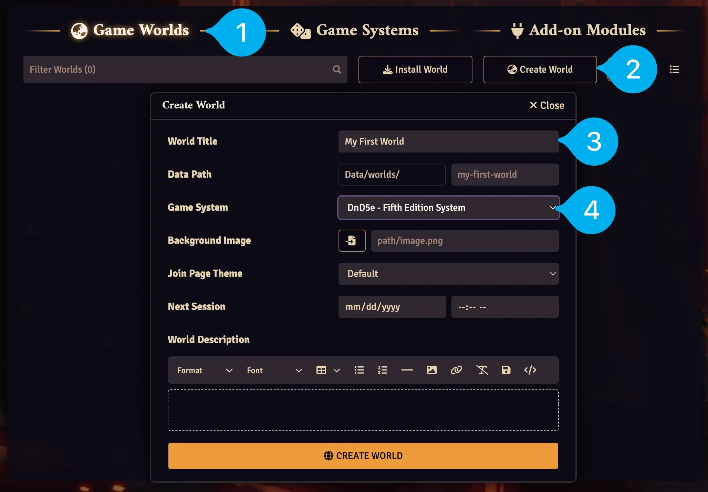
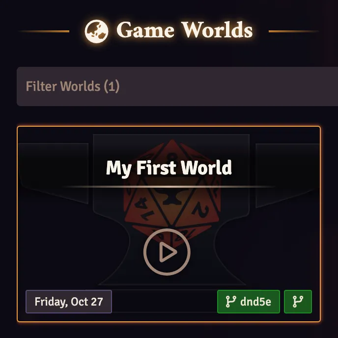
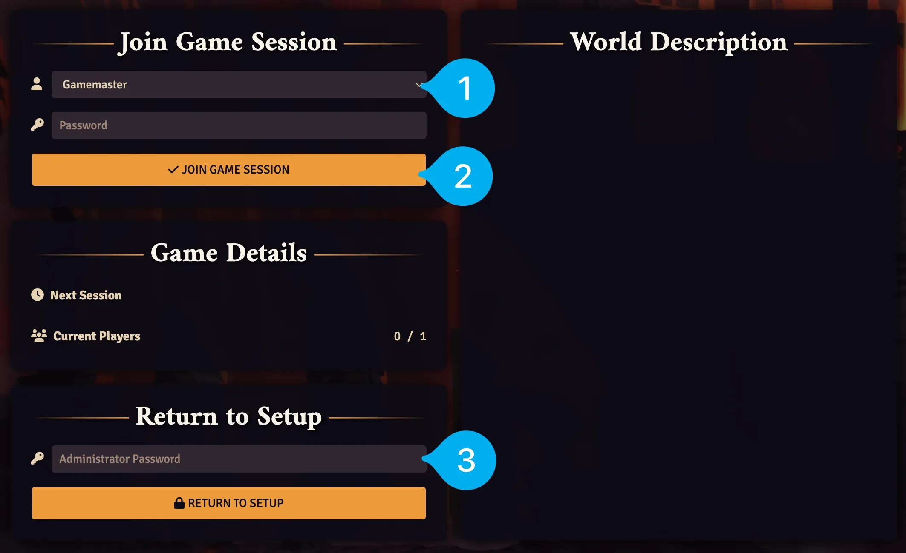

# Worlds
Worlds are where you'll run all of your games. You can run multiple campaigns in one World or split them out. Each World will contain its own set of Actors, Items, etc. but you can share media assets between all of them.

---

## Create a World

<figure markdown>
  { loading=lazy }
  <figcaption>Create a World</figcaption>
</figure>

<figure class="right" markdown>
  { loading=lazy width="300" }
  <figcaption>Launch a World</figcaption>
</figure>

Once you have a Game System installed it's easy to create a World.

1. Ensure you're on the :fontawesome-solid-globe: Game Worlds tab of the Setup screen.
2. Press the :fontawesome-solid-globe: Create World button.
3. Give your World a title with the `World Title` field.
4. Select your Game System from the `Game System` dropdown.
5. Fill out any of the other fields that you wish.
6. Press the :fontawesome-solid-globe: Create World button when you're finished.
7. Launch the World by hovering over it and clicking the :fontawesome-regular-circle-play: button.

Congratulations, you've launched your first World! Now let's look at how to log in.

---

## Log Into Your World

When you launch your World you'll be greeted with the World Login screen. This is the screen you and your players will see before entering your World. Here's how to log in:

<figure class="right" markdown>
  { loading=lazy width="300" }
  <figcaption>The World Log In Screen</figcaption>
</figure>

1. Select the `Gamemaster` account from the dropdown.
2. Press the :fontawesome-solid-check: Join Game Session button.

    !!! info "When a World is first created the `Gamemaster` account doesn't have a password so you can log in without one."

3. If you would like to return to the Setup screen you can enter your [Administrator Password](./install-foundry-vtt.md#add-an-administrator-password-optional) and press the :fontawesome-solid-lock: Return to Setup button.

!!! warning "You can't use the :fontawesome-solid-lock: Return to Setup feature without an Administrator Password."