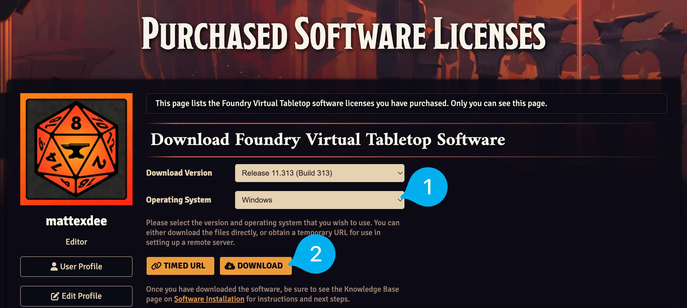
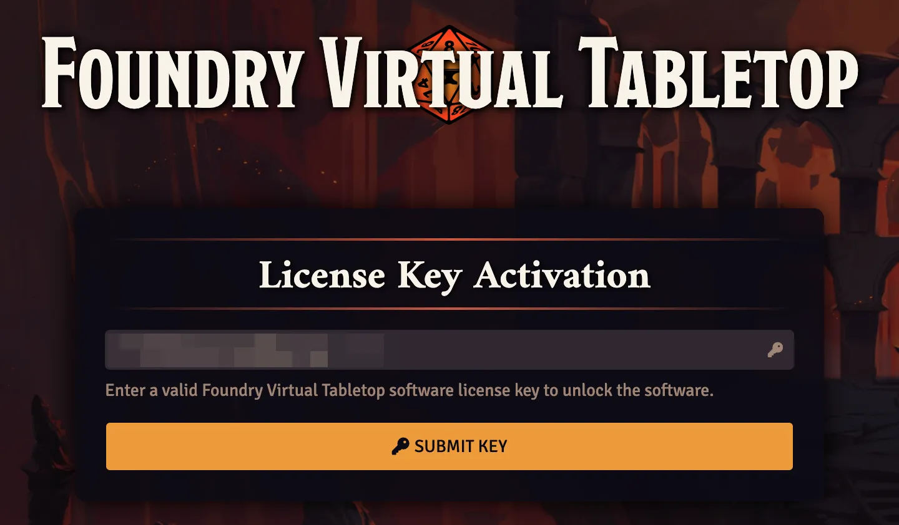
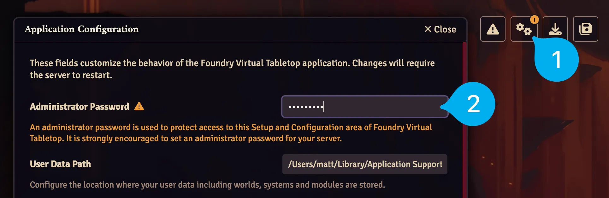

# Set Up Foundry VTT
Let's take a look at how you can install Foundry VTT on :material-microsoft-windows: Windows, :material-apple: Mac, and :material-linux: Linux. We'll also add a password to keep your data safe.

---

<figure class="right" markdown>
  { loading=lazy width="425" }
  <figcaption>Download Foundry VTT</figcaption>
</figure>

## Install Foundry VTT

1. Log in on the [Foundry website](https://foundryvtt.com) and head to your [Licenses page](https://foundryvtt.com/me/licenses).
2. Select your Operating System in the dropdown and press the `Download` button.
3. Once the download is finished, refer to the instructions for your Operating System below.

=== ":material-microsoft-windows: Windows"

    1. Run the downloaded installer.
    2. You may see a pop-up saying: 
    
        > Windows protected your PC

        without any option to continue. Press the `More info` link near the top and then press `Run anyway`.

        ??? question "Why am I seeing this warning?"
            This message appears when you try to run a piece of software that has not been explicitly vetted by Microsoft. In this case it's fine, but be careful with other pieces of software!
    3. Complete the installation and launch Foundry VTT.

=== ":material-apple: Mac"

    1. Open the downloaded file.
    2. Drag the Foundry VTT icon onto the `Applications` folder.
    3. Open your `Applications` folder, find Foundry VTT in the list, and right click on the Foundry icon and select `Open`.
    4. Dismiss the prompt that appears which says:

        > "Foundry Virtual Tabletop" cannot be opened because the developer cannot be verified. macOS cannot verify that this app is free from malware.
       
        ??? question "Why am I seeing this warning?"
            This message appears when you try to run a piece of software that has not been explicitly vetted by Apple. In this case it's fine, but be careful with other pieces of software!
    5. Right click on the Foundry icon again, select `Open` and press the `Open` button in the new prompt that appears to confirm you would like to run the software. You won't have to do this again until you update to a new version of Foundry VTT. 

=== ":material-linux: Linux"

    Foundry VTT is distributed as a simple `.zip` archive for Linux users. Here's how you can use it:

    1. Extract the zip file to any directory. For example, to unzip it to a `foundry` folder in your home directory enter: 
    ```bash
    unzip foundryvtt.zip -d $HOME/foundry
    ```
    2. Once the zip has finished extracting open your terminal to the extracted folder and enter: 
    ```
    ./foundryvtt
    ```
    ??? info "Run Foundry VTT with a double click in Linux"
        In some Linux distros (like Debian or Ubuntu) you can rename the `foundryvtt` file to have a `.sh` extension which you can double click to run the software.

---

## Activate Foundry VTT

<figure class="right" markdown>
  { loading=lazy width="425" }
  <figcaption>Activate Foundry VTT</figcaption>
</figure>

1. Copy the license key from your [Licenses](https://foundryvtt.com/me/licenses) page.
2. Paste it in and press the <span class="reference">:fontawesome-solid-key: Submit Key</span> button to activate the software.
3. Check the `I agree to these terms` box and click the <span class="reference">:fontawesome-solid-check: Agree</span> button to accept the End User License Agreement.
4. Follow or close the Tour that walks you through how to back up Packages (Worlds, Game Systems, and Modules) in Foundry VTT.
5. Opt in or out of sharing Anonymized Analytics with Foundry VTT about things like what Game Systems you play and what Modules you use. You can learn more by checking out their [Privacy Policy](https://foundryvtt.com/article/privacy-policy/).
6. Once you've made your choice you'll see the Setup screen for the first time!

---

## Add an Administrator Password (Optional)

<figure class="right" markdown>
  { loading=lazy width="425" }
  <figcaption>Secure Foundry VTT with an  Administrator Password</figcaption>
</figure>

The Setup screen is where you can manage your worlds. As a result, its important to keep it secure. Here's how to add an Administrator Password to make sure that unauthorized users can't make changes to your data:

1. Click on the <span class="reference">:fontawesome-solid-gears:</span> icon in the top-right hand corner.
2. Find the `Administrator Password` field and enter the password that you would like to use.
3. Press <span class="reference">:fontawesome-solid-floppy-disk: Save Configuration</span> at the bottom of the window.
4. Pres <span class="reference">:fontawesome-solid-check: Yes</span> to accept the prompt informing you that Foundry will restart to apply the changes.

Congratulations, you've installed and activated Foundry VTT! Next, let's look at installing a Game System and creating your first World.