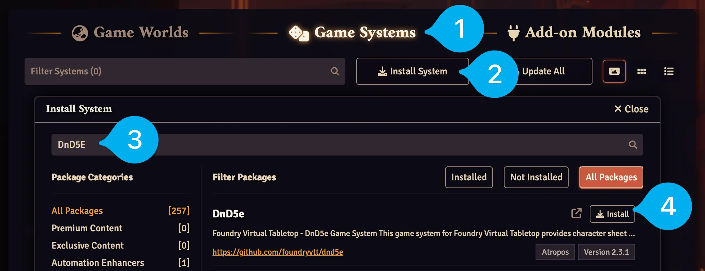

# Game Systems
Game Systems tell Foundry VTT how to do things like create characters and handle the rules for games like Dungeons and Dragons, Pathfinder 2nd Edition, and more. Foundry supports almost 300 community developed [Game Systems](https://foundryvtt.com/packages/systems) for easy installation.

---

## Install a Game System
<figure markdown>
  { loading=lazy }
  <figcaption>Install a Game System</figcaption>
</figure>

1. Ensure you're on the `Game Systems` tab of the Setup screen.
2. Press the `Install System` button.
3. Once the Package list loads you can search for your Game System at the top of the window. For example, you can find Dungeons & Dragons 5th Edition Game System by searching `DnD5E`.
4. Once you've found your Game System press the `Install` button.

You can now create a World with this Game System. Let's look at that next.