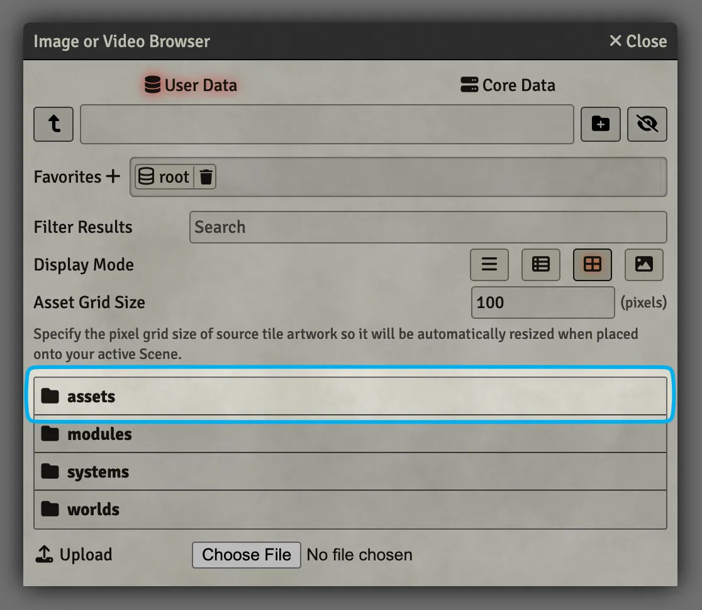
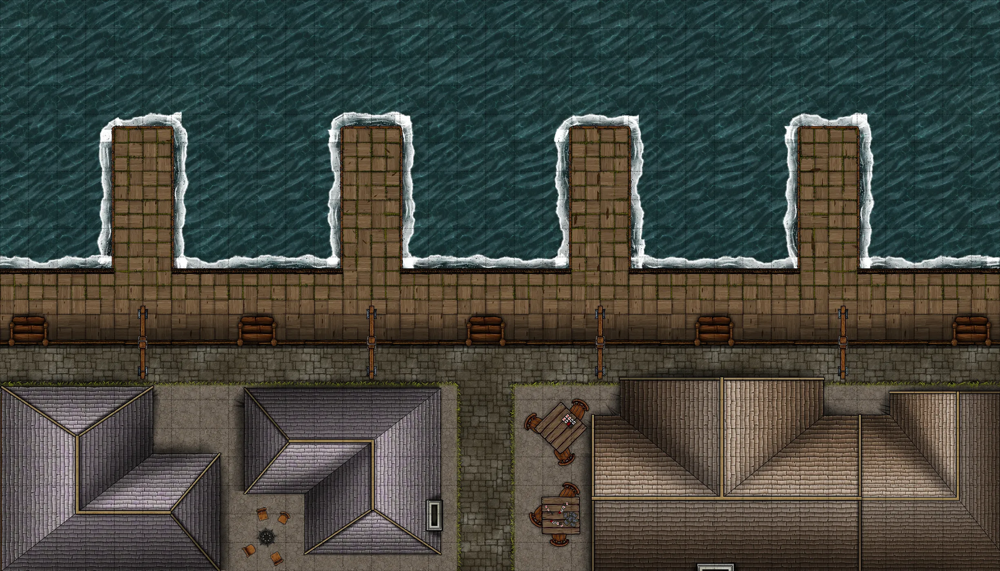
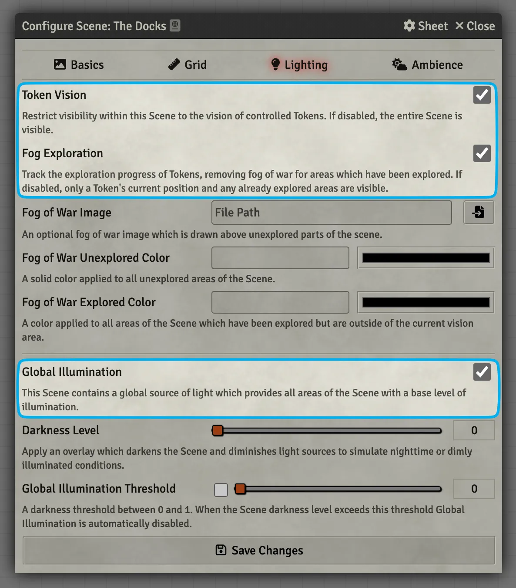
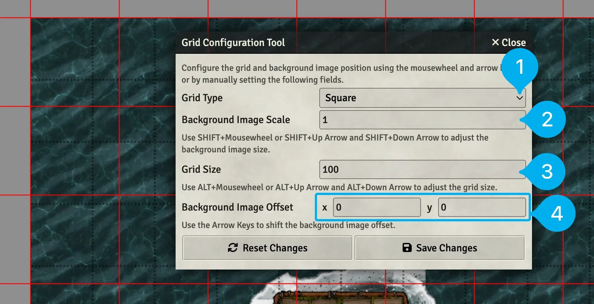

# Scenes
Scenes can be used to show your players art for theater of the mind or tactical battlemaps. Let's put together a simple battle map as a demo.

??? foundry-tip "Store your assets in a separate folder"
    <figure class="right" markdown>
        { loading=lazy width="300" }
        <figcaption>Store your assets in a separate folder</figcaption>
    </figure>

    I would recommend storing your files in an `assets` folder outside of your World's folder. This will make it easier to re-use content in multiple Worlds and to back up your Worlds using the built-in Foundry backup tool. It could be structured something like this (but feel free to organize it differently!):

    ```
    ├── assets
    │   ├── scenes
    │   ├── tiles
    │   ├── portraits
    │   ├── tokens
    │   ├── music
    │   ├── sfx
    ├── modules
    ├── systems
    ├── worlds
    ```

---

<figure class="right" markdown>
  { loading=lazy width="400" }
  <figcaption>Create a Scene</figcaption>
</figure>

## Create a Scene

1. Change to the <span class="reference">:fontawesome-solid-map:</span> Scenes tab in the sidebar.
2. Press the <span class="reference">:fontawesome-solid-map: Create Scene</span> button.
3. Enter a name for your Scene and press <span class="reference">:fontawesome-solid-check: Create New Scene</span>.

??? example "Follow along with a free demo map"

    You can follow along by downloading [The Docks](../assets/foundry-basics/create-scene/the-docks.webp){:target="_blank"} map I made in [DungeonDraft](https://dungeondraft.net/){:target="_blank"} with [Forgotten Adventures](https://www.forgotten-adventures.net/){:target="_blank"} assets.

    I've left the grid visible in this map so we can align it more easily but if you're creating your own maps and know the grid size I would recommend not including them and using only Foundry's built-in grid controls.

    <figure markdown>
        { loading=lazy }
        <figcaption>The Docks Battlemap</figcaption>
    </figure>

---

## Configure the Scene

It's easy to feel overwhelmed looking at the Scene Configuration options, but we're going to focus on just the important pieces and ignore the rest:

=== ":fontawesome-solid-image: Basics"

    <figure class="right w300" markdown>
        
        <figcaption>Important <span class="reference">:fontawesome-solid-image: Basics</span> Settings</figcaption>
    </figure>

    - **Scene Name:** You can name your Scene anything you'd like, including using emoji :eyes:! You'll use this name to find the Scene in the sidebar and in the Scene navigation bar at the top of the canvas.
    
    - **Background Image:** The background image is the main media for your Scene. You can choose an image or video by clicking on the <span class="reference">:fontawesome-solid-file-import:</span> File Picker button and picking one from your user data folder or by uploading it from your computer.

=== ":fontawesome-solid-ruler: Grid"

    <figure class="right w400" markdown>
        
        <figcaption>Important <span class="reference">:fontawesome-solid-ruler: Grid</span> Settings</figcaption>
    </figure>

    **Grid Type:** The grid shape for your Scene. You can choose from:

    - Gridless
    - Square
    - Hexagonal Rows - Odd
    - Hexagonal Rows - Even
    - Hexagonal Columns - Odd
    - Hexagonal Columns - Even
    
    The <span class="reference">:fontawesome-solid-ruler-combined:</span> Grid Configuration Tool will be covered in more detail below.
    
    **Grid Size:** The size of a grid square in pixels.

=== ":fontawesome-solid-lightbulb: Lighting"

    <figure class="right clearself w300" markdown>
        
        <figcaption>Important <span class="reference">:fontawesome-solid-lightbulb: Lighting</span> settings</figcaption>
    </figure>

    - **Token Vision:** Limits Tokens to only be able to see what their vision settings allow. This should almost always be checked for battlemaps and unchecked for theater of the mind Scenes.
    - **Fog Exploration:** Controls whether the fog of war remains revealed as Tokens move around a Scene.
      
        ??? foundry-tip "Demo and Common Use Cases"
            Leave this checked if you would like areas your players have explored to be "remembered" and leave the fog of war revealed. They will still not be able to see things like Tokens in previously explored areas once they are out of their line of sight. Uncheck it if you would like players to only be able to see what their Token can see in their immediate area.

            <figure class="video_container" markdown>
              <video controls="true" allowfullscreen="true">
                <source src="../../assets/foundry-basics/create-scene/fog-exploration-demo.webm" type="video/webm">
                Your browser does not support the video tag.
              </video>
              <figcaption markdown>Demo of Fog Exploration On/Off</figcaption>
            </figure>
    - **Global Illumination:** Cover all areas of the Scene with bright light.

        ??? foundry-tip "Demo and Common Use Cases"
            Check this option if you would like Tokens' line of sight to extend until a wall is in their way regardless of whether there are other lights in the Scene.

            <figure class="video_container" markdown>
              <video controls="true" allowfullscreen="true">
                <source src="../../assets/foundry-basics/create-scene/global-illumination-demo.webm" type="video/webm">
                Your browser does not support the video tag.
              </video>
              <figcaption markdown>Demo of Global Illumination On/Off</figcaption>
            </figure> 

---

## Align the Grid
Since the Foundry grid (the red squares) are larger than the dotted grid squares in the original image we can tell that Foundry's grid (currently set to 100) is too big. Let's get it working correctly!

<figure class="right w450" markdown>
  { loading=lazy }
  <figcaption>The Grid Alignment Tool</figcaption>
</figure>

### The Grid Configuration Tool
In the <span class="reference">:fontawesome-solid-ruler: Grid</span> tab of the Scene configuration window press the <span class="reference">:fontawesome-solid-ruler-combined:</span> Grid Configuration Tool button to start aligning your grid. The Foundry grid will become red, the Scene configuration window will minimize, and you'll be able to start making changes:

1. **Grid Type:** Select the type of grid.
2. **Background Image Scale:** Make the main content of your Scene larger or smaller.
3. **Grid Size:** The size of each grid square/hex in pixels. Minimum of 50 pixels.
4. **Background Image Offset:** Move the main content of your Scene to the left/right (X) and up/down (Y).

### Using the Grid Configuration Tool

<figure class="video_container" markdown>
  <video controls="true" allowfullscreen="true">
    <source src="../../assets/foundry-basics/create-scene/grid-alignment-tool.webm" type="video/webm">
    Your browser does not support the video tag.
  </video>
  <figcaption markdown>Demo of the Gird Alignment Tool with [The Docks](../assets/foundry-basics/create-scene/the-docks.webp) map</figcaption>
</figure>

1. Reduce the `Grid Size` by 10 until the square in the top-left starts to align.

    ??? foundry-tip "Realigning the Scene's Grid"
        As you change the `Grid Size` you may notice the grid lines no longer align with the top left corner of the Scene. You can fix this by temporarily changing the `Background Image Scale` by holding ++shift++ + Scrolling up 1 and then down 1. You can see an example of doing this in the demo below.

2. It appears that `70` is the correct value.
3. Now that the Scene is aligned click <span class="reference">:fontawesome-solid-floppy-disk: Save Changes</span> to finish.
