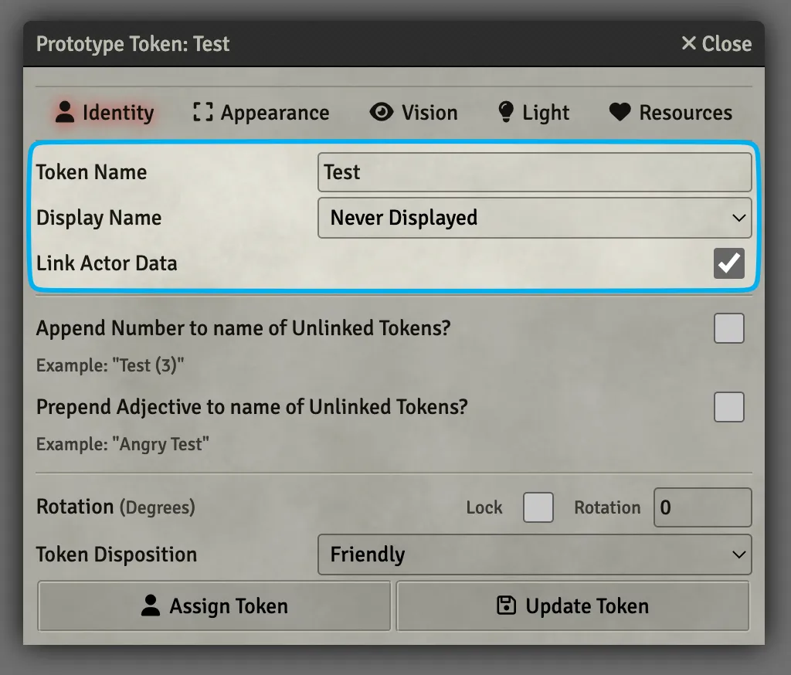
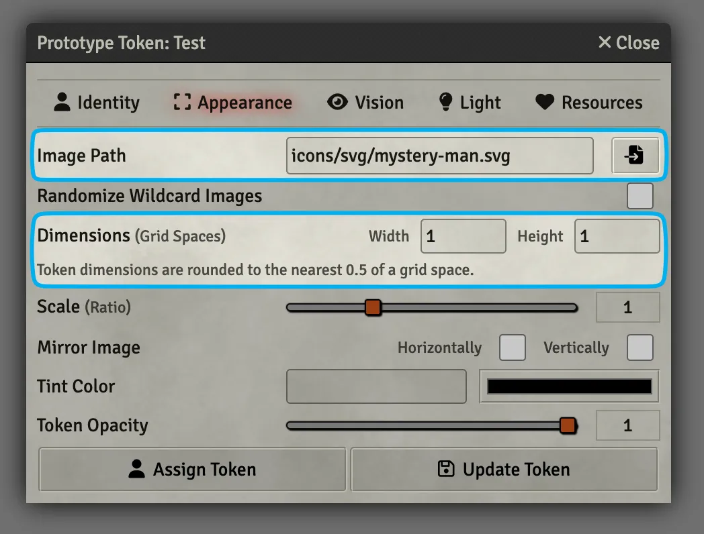

# Tokens
You can think of an Actor as the character sheet and a Token as the mini that represents it. You can drag any Actor onto a Scene to place a Token. You can control how an Actor looks each time its placed in a Scene by changing its Prototype Token settings.

## Prototype Token Settings

1. Open a character sheet by clicking on it in the :fontawesome-solid-user: Actor's tab.
2. In the top-right click on the :fontawesome-solid-circle-user: Prototype Token link.
3. Be strong and don't get intimidated by the tabs :muscle:. We're going to look at just the important parts.

=== ":fontawesome-solid-user: Identity"

    <figure class="right w300" markdown>
        
        <figcaption>:fontawesome-solid-user: Identity everything you **need** to know</figcaption>
    </figure>
    
    **Display Name:** When the Token's name should be visible and to whom.

    - `By Owner` means only users who own that Actor will be able to see it.
    - `When Controlled` means only when you've clicked on that Token.

    **Link Actor Data:** When enabled, any changes made to the Token will be made to the Actor as well. If it's turned off, each Token for that Actor will have its own character sheet. This makes it so you can have one goblin Actor and place 6 different goblins in a Scene that have their own HP and inventory.

=== ":fontawesome-solid-expand: Appearance"

    <figure class="right w400" markdown>
        
        <figcaption>:fontawesome-solid-expand: Appearance everything you **need** to know</figcaption>
    </figure>

    **Image Path:** The image for the Token.

    **Dimensions:** The number of grid spaces the Token takes up.

=== ":fontawesome-solid-eye: Vision"

    The :fontawesome-solid-eye: Vision tab is broken into *even more* tabs, but don't worry, we're gonna break these down too.

    === ":fontawesome-solid-eye: Basic Configuration"

        <figure class="right w300" markdown>
            
            <figcaption>:fontawesome-solid-user: Identity everything you **need** to know</figcaption>
        </figure>
        
        **Display Name:** When the Token's name should be visible and to whom.

        - `By Owner` means only users who own that Actor will be able to see it.
        - `When Controlled` means only when you've clicked on that Token.

        **Link Actor Data:** When enabled, any changes made to the Token will be made to the Actor as well. If it's turned off, each Token for that Actor will have its own character sheet. This makes it so you can have one goblin Actor and place 6 different goblins in a Scene that have their own HP and inventory.

    === ":material-radar: Detection Modes"

        <figure class="right w400" markdown>
            
            <figcaption>:fontawesome-solid-expand: Appearance everything you **need** to know</figcaption>
        </figure>

    === ":material-cogs: Advanced Options"

        <figure class="right w400" markdown>
            
            <figcaption>:fontawesome-solid-expand: Appearance everything you **need** to know</figcaption>
        </figure>

    <figure class="right clearself w300" markdown>
        
        <figcaption>:fontawesome-solid-lightbulb: Lighting everything you **need** to know</figcaption>
    </figure>

    **Token Vision:** Leave this checked if you would like your player's vision to be limited to what their Token's can see. This should almost always be checked for battlemaps and unchecked for theater of the mind Scenes.

=== ":fontawesome-solid-lightbulb: Light"

    <figure class="right clearself w300" markdown>
        
        <figcaption>:fontawesome-solid-lightbulb: Lighting everything you **need** to know</figcaption>
    </figure>

    **Token Vision:** Leave this checked if you would like your player's vision to be limited to what their Token's can see. This should almost always be checked for battlemaps and unchecked for theater of the mind Scenes.

=== ":fontawesome-solid-heart: Resources"

    <figure class="right clearself w300" markdown>
        
        <figcaption>:fontawesome-solid-lightbulb: Lighting everything you **need** to know</figcaption>
    </figure>

    **Token Vision:** Leave this checked if you would like your player's vision to be limited to what their Token's can see. This should almost always be checked for battlemaps and unchecked for theater of the mind Scenes.

---