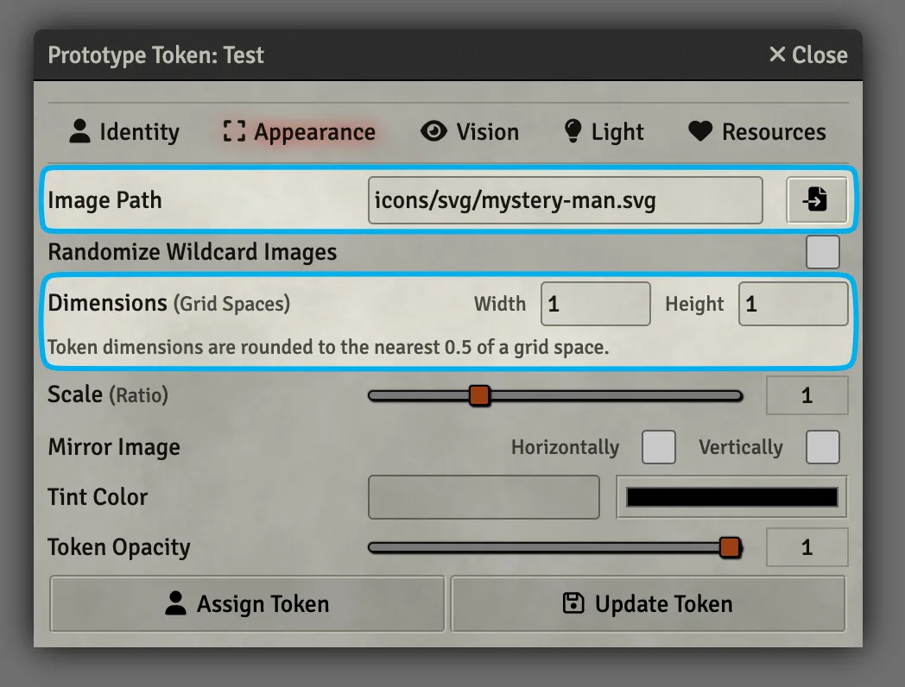

# Tokens
You can think of an Actor as the character sheet and a Token as the mini that represents it. You can drag any Actor onto a Scene to place a Token. You can control how an Actor looks each time its placed in a Scene by changing its Prototype Token settings.

---

## Prototype Token Settings

1. Open a character sheet by clicking on it in the :fontawesome-solid-user: Actor's tab.
2. In the top-right click on the :fontawesome-solid-circle-user: Prototype Token link.
3. Be strong and don't get intimidated by all the options :muscle:. We're going to look at just the important parts:

=== ":fontawesome-solid-user: Identity"

    <figure class="right w300" markdown>
        
        <figcaption>Important :fontawesome-solid-user: Identity Settings</figcaption>
    </figure>
    
    - **Display Name:** Controls when the Token's name is visible. The options include:
        - Never Displayed
        - When Controlled
        - Hovered by Owner
        - Hovered by Anyone
        - Always for Owner
        - Always for Everyone
    - **Link Actor Data:** Controls whether changes to the Token will also impact the Actor.
    
        When enabled, any changes made to the Token will be made to the Actor as well. If it's turned off, each Token for that Actor will have its own character sheet. This makes it so you can have one goblin Actor and place 6 different goblins in a Scene that have their own HP and inventory.

=== ":fontawesome-solid-expand: Appearance"

    <figure class="right w400" markdown>
        
        <figcaption>Important :fontawesome-solid-expand: Appearance Settings</figcaption>
    </figure>

    - **Image Path:** The image or video for the Token.
    - **Dimensions:** The number of grid spaces the Token takes up.

=== ":fontawesome-solid-eye: Vision"

    <figure class="right w400" markdown>
        
        <figcaption>Important :fontawesome-solid-eye: Basic Configuration Settings</figcaption>
    </figure>

    This tab is broken into *even more* tabs, but don't worry, you only need to pay attention to the :fontawesome-solid-eye: Basic Configuration tab:

    - **Vision Enabled:** Controls whether a Token can see at all.

        ??? foundry-tip "Disable Vision for NPCs"
            NPCs are often created without their vision enabled so that the Gamemaster doesn't lose visibility over the Scene when moving their Token.

    - **Vision Range:** Set this to the distance that the Token can see *without any light*. For example, a creature with 60 feet of darkvision should have 60 here. A creature with no darkvision should have 0.

=== ":fontawesome-solid-lightbulb: Light"

     <figure class="right clearself w350" markdown>
        
        <figcaption>Important :fontawesome-solid-lightbulb: Light Settings</figcaption>
    </figure>

    You can skip this section entirely if the Token isn't emitting any light (like from a torch).

    - **Light Radius:** The distance that the Token is emitting **dim** and **bright** light. For example: a torch might shine 40 feet of dim light and 20 feet of bright light.

=== ":fontawesome-solid-heart: Resources"

    <figure class="right clearself w300" markdown>
        
        <figcaption>Important :fontawesome-solid-heart: Resources Settings</figcaption>
    </figure>

    - **Display Bars:** Controls when the Token's resource bars are visible. The options include:
        - Never Displayed
        - When Controlled
        - Hovered by Owner
        - Hovered by Anyone
        - Always for Owner
        - Always for Everyone
    - **Bar X Attribute:** Controls which attribute is used for each resource bar. For example, Hit Points.