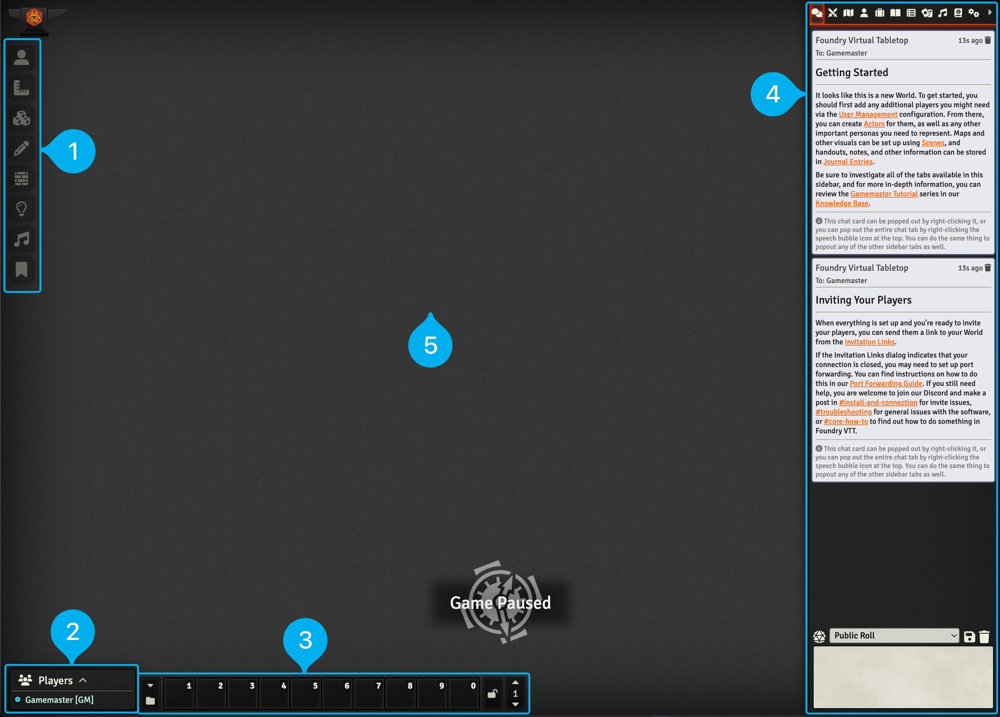
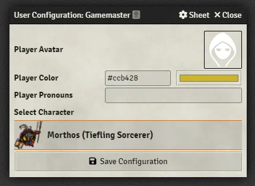

# The User Interface
This is the Foundry VTT interface you see when you log in for the first time. Let's break it down:

<figure markdown>
  { loading=lazy }
  <figcaption>The Foundry VTT Interface</figcaption>
</figure>

=== "1. Scene Tools"

    The Scene Tools let you and your players (who will see a few less options) interact with things on the canvas. When there's no Scene open you can't use these tools.

    - <strong>:fontawesome-solid-user: Tokens:</strong> A Token is an Actor that has been placed in a Scene and the Token tools will let you interact with them.

    - <strong>:fontawesome-solid-ruler-combined: Rulers:</strong> Rulers let you measure distance and place area of effect templates in a Scene.
    
    - <strong>:fontawesome-solid-cubes: Tiles:</strong> The Tile tools allow you to place and move images and videos in a Scene.
    
    - <strong>:fontawesome-solid-pencil: Drawings:</strong> Draw shapes, freehand, or place text boxes in a Scene.
    
    - <strong>:material-wall: Walls:</strong> Place Walls (including doors and windows) in a Scene to control your player's vision and fog of war.

    - <strong>:fontawesome-regular-lightbulb: Lights:</strong> Place Lights in a Scene to help your players see and provide animated effects.
    
    - <strong>:fontawesome-solid-music: Ambient Audio:</strong> Place sounds in a Scene that your players will hear as they approach.
    
    - <strong>:fontawesome-solid-bookmark: Notes:</strong> Pin pages from your Journal Entries in a Scene for quick reference.

=== "2. Players List"

    <figure class="right" markdown>
        { loading=lazy }
        <figcaption>The User Configuration Window</figcaption>
    </figure>

    The players list shows all of your logged in players. You can right click on a username in the list and click the :material-human-male: User Configuration option to set things like their:

    - **Avatar:** The image used when a player posts a message in the chat log.
    - **Player Color:** The color that represents the player. Applies to borders on their chat messages, pings, targetting, and their mouse cursor indicator.
    - **Pronouns:** The player's pronoun preference.
    - **Default Character:** The character that they will act as by default if none is selected.
    
    Your players will also be able to configure this themselves.

    !!! foundry-tip "You can see logged out players by clicking on the caret next to `Players`."

=== "3. Macro Bar"

    Foundry supports Macros for rolling dice and running custom scripts. You can click on an empty box to create a new Macro or drag an Item from your character sheet to the Macro bar for quick access to it. You can have multiple pages of Macros by clicking the up and down arrows to the right.

    !!! foundry-tip "You can also run a Macro by pressing the number assigned to its square on your keyboard."

=== "4. Sidebar"

    !!! foundry-tip "Right click on any tab to pop it out. This allows you to rearrange the UI and access multiple tabs at once."

    The sidebar is where you can find all of your World's useful data.

    - <strong>:fontawesome-solid-comments: Chat:</strong> Chat messages, whispers, item/feature uses, and rolls will appear here. You and your players can configure who can see their rolls by changing the dropdown to Public Roll, Private GM Roll, Blind GM Roll, or Self-Roll. Gamemaster users will be able to see every roll except self rolls.

    - <strong>:material-sword-cross: Combat:</strong> Start and track Encounters here.
    
    - <strong>:fontawesome-solid-map: Scenes:</strong> Scenes for theater of the mind moments and tactical battle maps are stored here.
    
    - <strong>:fontawesome-solid-user: Actors:</strong> Characters for your players, creatures, and NPCs are stored here.
    
    - <strong>:fontawesome-solid-suitcase: Items:</strong> Items, spells, character abilities, and more are stored here.

    - <strong>:fontawesome-solid-book-open: Journal Entries:</strong> Journal entries for planning your adventures, tracking progress, and any other note taking are stored here.
    
    - <strong>:fontawesome-solid-table-list: Roll Tables:</strong> Roll tables, which are tables of options that can be rolled on for a random result, are stored here.
    
    - <strong>:material-cards: Cards:</strong> Decks/stacks of cards and hands are stored here.

    - <strong>:fontawesome-solid-music: Music:</strong> Playlists and soundboards are stored here. Each player can also independently control their volume from this tab.

    - <strong>:fontawesome-solid-book-atlas: Compendium Packs:</strong> Compendium Packs are long term storage for everything we just covered (except Encounters). You can think of it as cold storage for your data which will make your World load more quickly.

    - <strong>:material-cogs: Settings:</strong> This tab contains a number of useful tools that let you: configure your settings, controls, manage Modules, edit your World's details, manage the Users in your World, explore Foundry's features with Tours, generate a Support Report, check out the official documentation, the community Wiki, get your Invitation Links, log out, and Return to Setup. Some of these options are only available for Gamemasters.

=== "5. Canvas"

    This is where Scenes will display and where you'll interact with Tokens, Tiles, Lights, Walls, and the rest of the tools in your Scene Tools.

    ??? question "What does `Game Paused` mean?"
        When the game is paused players will not be able to move their Tokens or open doors. You can pause and unpause the game by pressing ++space++.