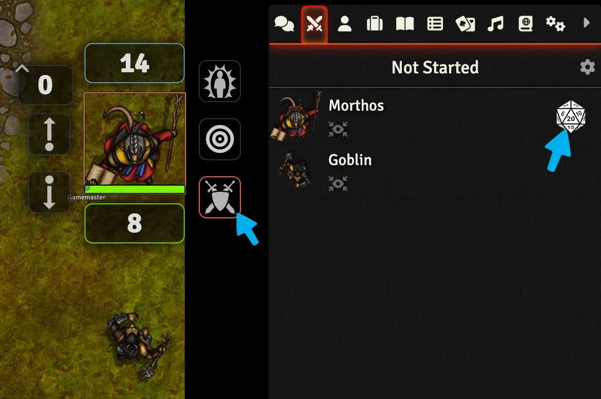

# The Combat Tracker
Running combat varies from Game System to Game System but let's take a look at how the basics of the combat tracker works in Foundry VTT.

---

<figure class="right w450" markdown>
  { loading=lazy }
  <figcaption>Toggle your combat state and roll initiative.</figcaption>
</figure>

## Entering Combat and Rolling Initiative
Your GM may add you to the combat tracker themselves, but you can also toggle your combat state by clicking the sword and shield button from your [Token’s UI](token-features.md).

Similarly, the DM can automatically roll initiative for everyone in the encounter but you can roll it yourself by right from the combat tracker by clicking the :material-sword-cross: icon in the right-hand sidebar and then clicking the D20 next to your character’s name to roll.

??? foundry-tip "Pop Out the Combat Tracker"

    Right click on the Combat Tracker's icon to pop it out of the right-hand sidebar. Then you can arrange it wherever you'd like and keep the sidebar on the Chat Log.

---

<figure class="right w450 video_container" markdown>
  <video controls="true" allowfullscreen="true">
    <source src="../../assets/foundry-players-guide/combat-tracker/area-of-effect.webm" type="video/webm">
    Your browser does not support the video tag.
  </video>
  <figcaption markdown>Rotate and place area of effect templates.</figcaption>
</figure>

## Making Attacks and Using Items
Every Game System's character sheet works differently but you should be able to click on the icon for your item, feature, or spell to send it to the Chat Log.

??? foundry-tip "Pop Out Chat Cards"

    If there's an item, spell, or feature that you can use repeatedly like a Spiritual Weapon you can right click on the Chat Card and select :octicons-link-external-16: Pop Out Chat Card to continue to have access to its Attack, Saving Throw, and Damage buttons.

### Area of Effect Templates
Some abilities and spells impact an entire area. When you use one of these abilities Foundry will prompt you to place a measured template. These templates can be rotated by holding ++ctrl++ and scrolling up or down.

### Applying Healing and Damage
If an attack or healing spell applies to you, you can right click on it and apply its value as healing or damage to your Token. You can also apply healing or damage through your Token's Resource Bars by entering a value like "+15" or "-10".