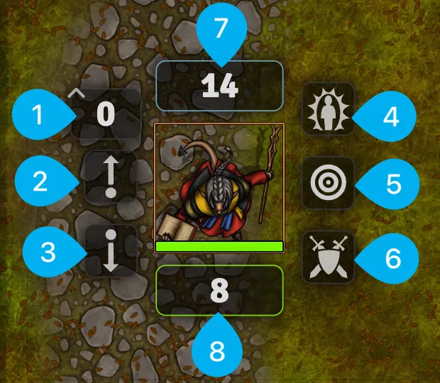

# Using Your Token
Your Token is how you'll interact with Foundry most of the time. If your Actor is your character sheet, you can think of your Token as your mini. Let's look at what you can do with it now.

---

## The Token UI
<figure class="right w450" markdown>
  { loading=lazy }
  <figcaption>The Token User Interface</figcaption>
</figure>

1. **Elevation:** Sets your characters elevation and is useful for tracking your position when using something like a Fly spell.
2. **Move Up:** When multiple Tokens are present in the same square you can use this button to move your Token to the top of the stack.
3. **Move Down:** When multiple Tokens are present in the same square you can use this button to move your Token to the bottom of the stack.
4. **Status Effects:** When your character is impacted by a status effect like "Unconscious" you can set it using one of the effects in the Status Effects tray. Left click to add a small icon and right click to place a larger icon on your Token.
5. **Target:** Target this Token.
6. **Toggle Combat State:** Press this button to add or remove yourself from the combat tracker.
7. **Resource Tracker:** Displays any resource from your character sheet like Armor Class or Hit Points.
8. **Resource Tracker:** Displays any resource from your character sheet like Armor Class or Spell Slots.

---

<figure class="right w450 video_container" markdown>
  <video controls="true" allowfullscreen="true">
    <source src="../../assets/foundry-players-guide/tokens/movement.webm" type="video/webm">
    Your browser does not support the video tag.
  </video>
  <figcaption markdown>Place waypoints with a click to measure out your movement.</figcaption>
</figure>

## Movement
You can drag your token to a new place and it will go there right away. You can also move around using the ++w+a+s+d++ or the ++up+down+left+right++ keys.

### Plan and Measure Your Movement with Waypoints
1. Hold the ++ctrl++ key (++cmd++ on a Mac) and drag away from your Token.
2. Left click to place a waypoint and keep adding more movement.
3. Once you’re satisfied with your planned movement just hit ++space++ and your Token will move quickly along the path that you set.

---

## Vision

<figure class="right w450 video_container" markdown>
  <video controls="true" allowfullscreen="true">
    <source src="../../assets/foundry-players-guide/tokens/doors-and-rotating.webm" type="video/webm">
    Your browser does not support the video tag.
  </video>
  <figcaption markdown>Players can open Doors and their line of sight updates automatically.</figcaption>
</figure>

Foundry has a very powerful vision and lighting system which includes support for things like darkvision, tremorsense, true sight, and other magically enhanced sight. Your Gamemaster may use all of these features for dynamic line of sight or none of them and just reveal fog of war manually. Here's what impacts what your Token can see when using the light and vision system:

- **Light:** If there's no light in a Scene you'll need darkvision or a torch to be able to see. There are also magical darknesses which can be placed in a Scene that you won't be able to see through even with darkvision.
- **Walls:** Foundry has a lot of Wall types like basic walls, windows, doors, and more. Depending on the type of wall, it will block your vision. Players have the ability to open doors if they're unlocked and your line of sight will update automatically while you navigate the Scene.