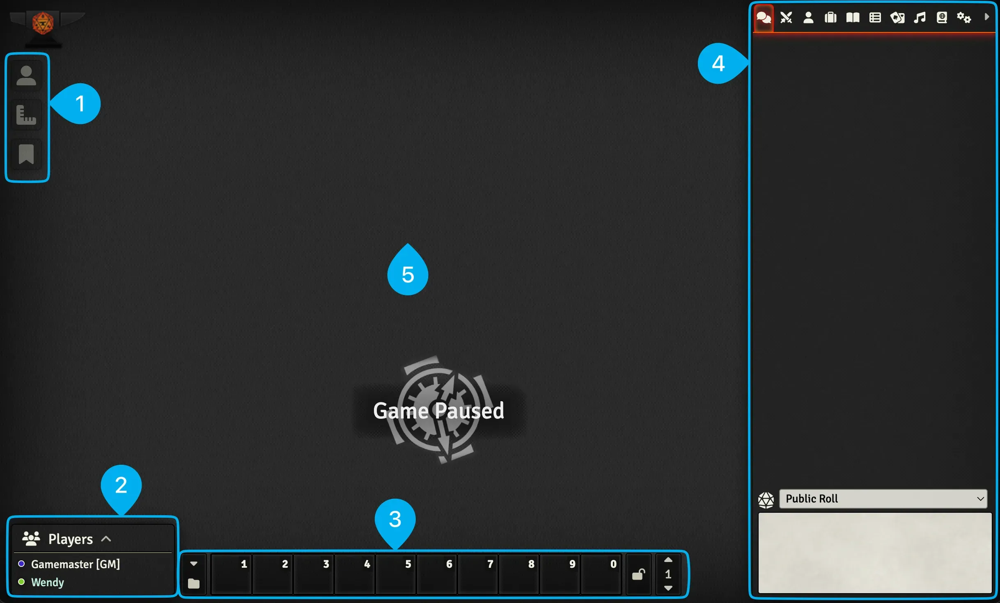
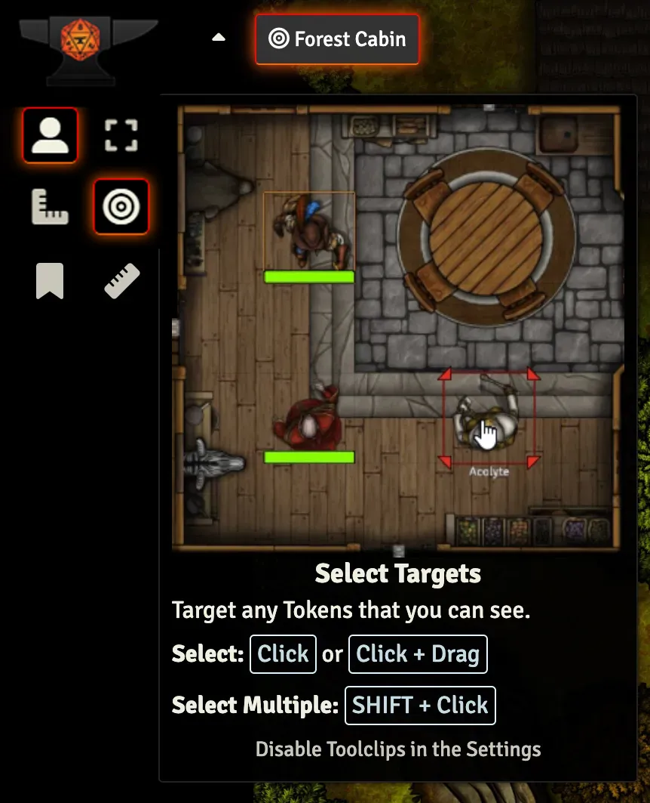
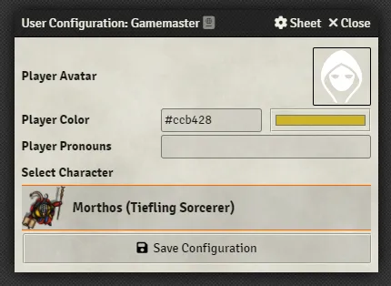

# The User Interface
This part of the guide is going to focus on the basic user interface. This will all be done using core Foundry features so some things might be different if your DM has installed modules to change how Foundry works. Let’s get started!

---

<figure markdown>
  { loading=lazy }
  <figcaption>The User Management Page</figcaption>
</figure>

=== "1. Scene Tools"

    <figure class="right w350" markdown>
        { loading=lazy }
        <figcaption>Toolclips break down every tool in the sidebar.</figcaption>
    </figure>

    The Scene Tools let you interact with things on the canvas. When there's no Scene open you can't use these tools. If you hover over one of the tools it will show you a quick example of how it works.

    - <strong>:fontawesome-solid-user: Tokens:</strong> A Token is an Actor that has been placed in a Scene and the Token tools will let you interact with them.

    - <strong>:fontawesome-solid-ruler-combined: Rulers:</strong> Rulers let you measure distance and place area of effect templates in a Scene.
    
    - <strong>:fontawesome-solid-bookmark: Notes:</strong> See pages pinned to the Scene from Journal Entries in a Scene if your Gamemaster has given you access to them.

    !!! foundry-tip "Hover to learn more about each tool."

        Every tool in the sidebar has a helpful toolclip that you can see by hovering over it which will explain how you can use it. Once you're more familiar with how they work you can disable these toolclips in the Settings.

=== "2. Players List"

    <figure class="right" markdown>
        { loading=lazy }
        <figcaption>The User Configuration Window</figcaption>
    </figure>

    The players list shows all of the logged in players. You can right click on your username in the list and click the :material-human-male: User Configuration option to set things like your:

    - **Avatar:** The image used when you post a message in the chat log.
    - **Player Color:** The color that represents you. Applies to borders on your chat messages, pings, targetting, and your mouse cursor indicator.
    - **Pronouns:** Your pronoun preference.
    - **Default Character:** The character that you will act as by default if none are selected.

    !!! foundry-tip "You can see logged out players by clicking on the caret next to `Players`."

=== "3. Macro Bar"

    Foundry supports Macros for rolling dice and running custom scripts. You can click on an empty box to create a new Macro or drag an Item from your character sheet to the Macro bar for quick access to it. You can have multiple pages of Macros by clicking the up and down arrows to the right.

    !!! foundry-tip "You can also run a Macro by pressing the number assigned to its square on your keyboard."

=== "4. Sidebar"

    !!! foundry-tip "Right click on any tab to pop it out. This allows you to rearrange the UI and access multiple tabs at once."

    The sidebar is where you can find all of your World's useful data.

    - <strong>:fontawesome-solid-comments: Chat:</strong> Chat messages, whispers, item/feature uses, and rolls will appear here. You can configure who can see your rolls by changing the dropdown to Public Roll, Private GM Roll, Blind GM Roll, or Self-Roll. Gamemaster users will be able to see every roll except self rolls.

    - <strong>:material-sword-cross: Combat:</strong> When your Gamemaster starts an encounter you can track turns here.
    
    - <strong>:fontawesome-solid-user: Actors:</strong> Your character and any other Actors you need for things like familiars, summons, etc. will appear here.
    
    - <strong>:fontawesome-solid-suitcase: Items:</strong> Any items, spells, character abilities, and more that aren't on your character are visible here if you own them.

    - <strong>:fontawesome-solid-book-open: Journal Entries:</strong> Journal entries for planning your adventures, tracking progress, and any other note taking are stored here.
    
    - <strong>:fontawesome-solid-table-list: Roll Tables:</strong> Roll tables, which are tables of options that can be rolled on for a random result, are stored here.
    
    - <strong>:material-cards: Cards:</strong> Decks/stacks of cards and hands are stored here.

    - <strong>:fontawesome-solid-music: Music:</strong> Playlists and soundboards are stored here. Each player can also independently control their volume from this tab.

    - <strong>:fontawesome-solid-book-atlas: Compendium Packs:</strong> Compendium Packs are long term storage for everything we just covered (except Encounters). You can think of it as cold storage for your data which will make the World load more quickly.

    - <strong>:material-cogs: Settings:</strong> This tab contains a number of useful tools that let you: configure your settings, controls, explore Foundry's features with Tours, check out the official documentation, the community Wiki, and log out.

=== "5. Canvas"

    This is where Scenes will display and where you'll interact with your Token and the rest of the elements in your toolbar.

    ??? question "What does `Game Paused` mean?"
        When the game is paused you will not be able to move your Tokens or open doors. The Gamemaster can pause and unpause the game by pressing ++space++.